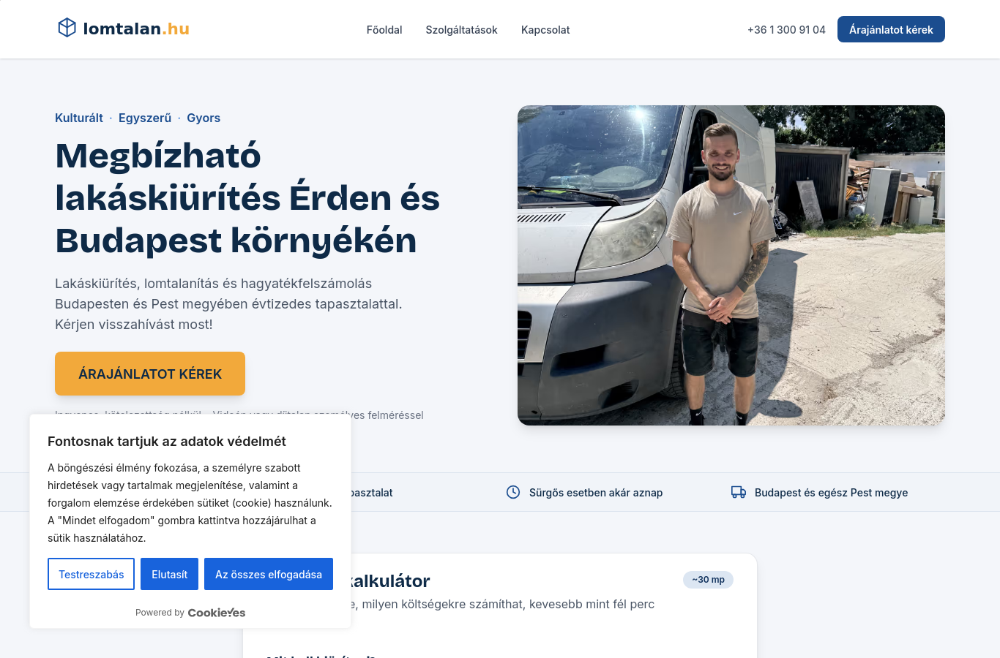
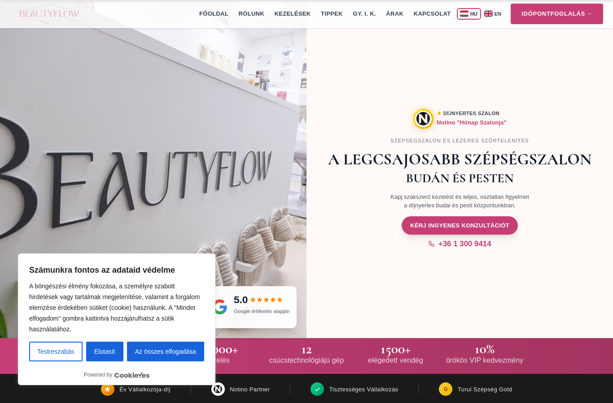
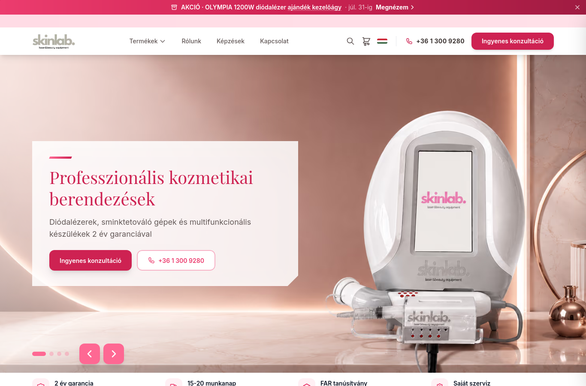
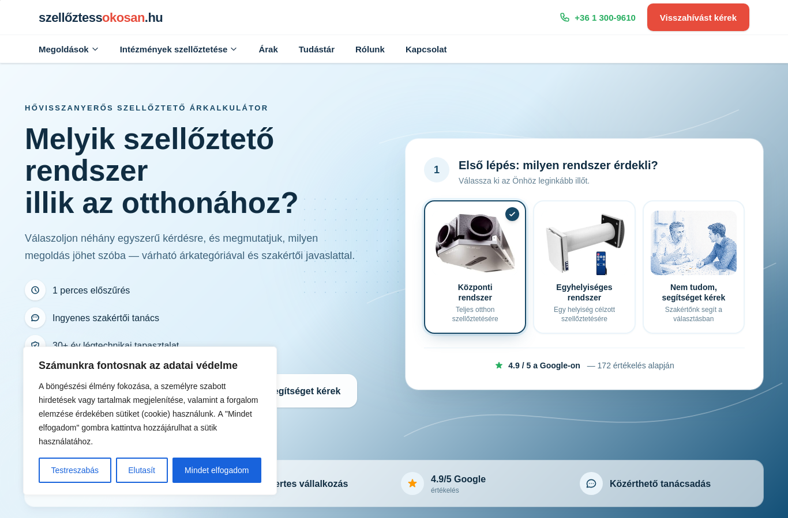
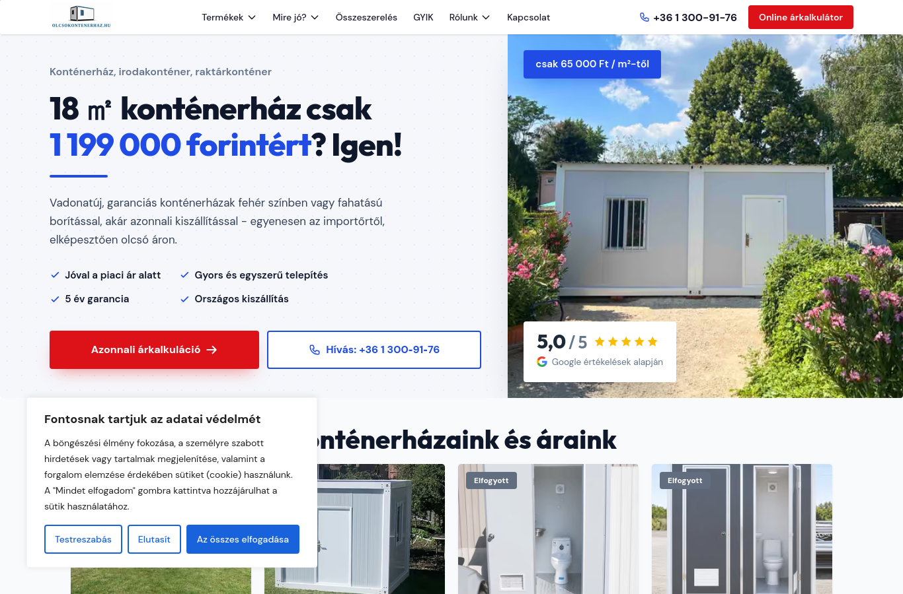
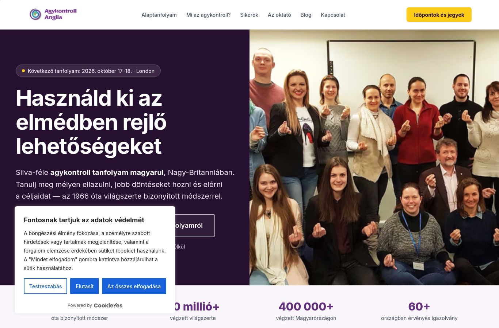
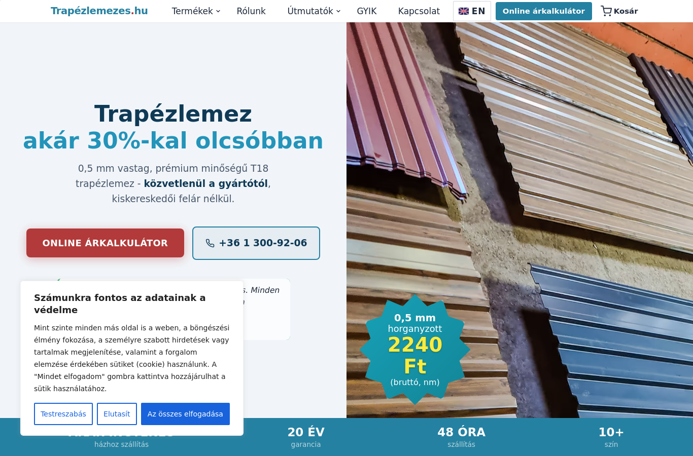
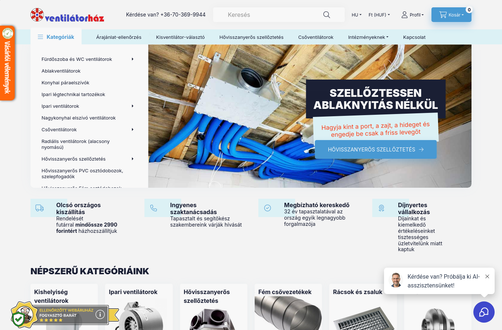
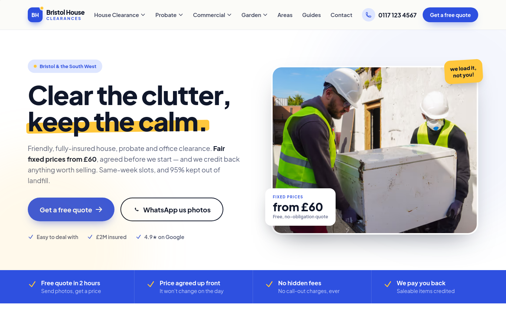

# Consent compliance baseline

**Futás:** `npm run compliance -- --browser=webkit --out=tests/compliance/reports/2026-08-17-webkit-norelay`  
**Kezdet:** 2026-08-17T08:02:51.482Z · **Vége:** 2026-08-17T08:10:00.165Z  
**Böngészők:** webkit  
**Teszt-IP országa:** US — a banner megjelenése geo-függő lehet.

> ## ⚠️ A BASELINE ÉRVÉNYESSÉGE KORLÁTOZOTT
> - **A mérés `US` IP-ről futott, miközben minden site `eea_uk` szabályrendszerű.** A CMP-megjelenítés és a tag-viselkedés geo-függő lehet, ezért ez a futás NEM alkalmas az EEA/UK viselkedés megállapítására: a hiányzó banner vagy kontroll itt N-A-ként jelenik meg, nem hibaként. A baseline-t HU/UK kilépőpontról meg kell ismételni.
> - **Hiányzó böngésző: chromium.** A Safari ITP a first-party storage-ot eltérően kezeli, ezért a storage-hoz kötődő ellenőrzések csak a mért böngészőre érvényesek (`npx playwright install webkit && npm run compliance -- --browser=webkit`).

> Ez MÉRÉS, nem javítás. A harness kizárólag olvas és megfigyel: egyetlen űrlapot sem küld be, egyetlen konverziót sem vált ki (a first-party nem-GET kéréseket hálózati szinten abortálja, a submit-eseményeket a DOM-ban blokkolja, és csak a consent-banner gombjaira kattint).

## Áttekintés

| Site | A: nincs tag consent előtt | A: GTM nem tölt | A: nincs süti | A: nincs storage-írás | A: nincs storage-olvasás | A: nincs noscript iframe | UI: van reject | UI: egyenrangú | UI: 1 kattintás | C: nincs tag reject után | C: nincs süti reject után | C: ping azonosító nélkül | D: visszavonás töröl |
|---|---|---|---|---|---|---|---|---|---|---|---|---|---|
| `painless` (webkit) | ❌ | ❌ | ✅ | ✅ | ✅ | ❌ | ✅ | ✅ | ✅ | ✅ | ✅ | – | – |
| `lomtalan` (webkit) | ❌ | ❌ | ✅ | ✅ | ✅ | ❌ | ✅ | ❌ | ✅ | ✅ | ✅ | – | – |
| `beautyflow` (webkit) | ❌ | ❌ | ✅ | ✅ | ✅ | ❌ | ✅ | ❌ | ✅ | ✅ | ✅ | – | – |
| `skinlab` (webkit) | ❌ | ❌ | ✅ | ✅ | ✅ | ❌ | – | – | – | – | – | – | – |
| `szelloztetes` (webkit) | ❌ | ❌ | ❌ | ✅ | ✅ | ❌ | ✅ | ❌ | ✅ | ✅ | ❌ | – | – |
| `kontenerhaz` (webkit) | ❌ | ❌ | ✅ | ✅ | ✅ | ❌ | ✅ | ❌ | ✅ | ✅ | ✅ | – | – |
| `agykontroll` (webkit) | ❌ | ❌ | ✅ | ✅ | ✅ | ❌ | ✅ | ❌ | ✅ | ✅ | ✅ | – | – |
| `trapezlemezes` (webkit) | ❌ | ❌ | ✅ | ✅ | ✅ | ❌ | ✅ | ❌ | ✅ | ✅ | ✅ | – | – |
| `nemesventilatorhaz` (webkit) | ❌ | ❌ | ❌ | ✅ | ❌ | ❌ | – | – | – | – | – | – | – |
| `skinlab_hu` (webkit) | ✅ | ✅ | ✅ | ✅ | ✅ | ✅ | – | – | – | – | – | – | – |
| `bristolheatpump` (webkit) | ✅ | ❌ | ✅ | ✅ | ✅ | ❌ | – | – | – | – | – | – | – |
| `bristolhouseclearances` (webkit) | ✅ | ✅ | ✅ | ✅ | ✅ | ✅ | – | – | – | – | – | – | – |
| `bristolcleaningheroes` (webkit) | ✅ | ❌ | ✅ | ✅ | ✅ | ❌ | – | – | – | – | – | – | – |

✅ megfelel · ❌ bukik · – nem értelmezhető / nem mérhető · ⚠️ a site mérése hibára futott

## Hány oldal bukik melyik ponton

| Ellenőrzés | ❌ bukik | ✅ megfelel | – n/a |
|---|---:|---:|---:|
| A: nincs tag consent előtt | **9** | 4 | 0 |
| A: GTM nem tölt | **11** | 2 | 0 |
| A: nincs süti | **2** | 11 | 0 |
| A: nincs storage-írás | **0** | 13 | 0 |
| A: nincs storage-olvasás | **1** | 12 | 0 |
| A: nincs noscript iframe | **11** | 2 | 0 |
| UI: van reject | **0** | 7 | 6 |
| UI: egyenrangú | **6** | 1 | 6 |
| UI: 1 kattintás | **0** | 7 | 6 |
| C: nincs tag reject után | **0** | 7 | 6 |
| C: nincs süti reject után | **1** | 6 | 6 |
| C: ping azonosító nélkül | **0** | 0 | 13 |
| D: visszavonás töröl | **0** | 0 | 13 |

## A site-manifestben NEM szereplő, mégis mért oldalak

`trapezlemezes`, `nemesventilatorhaz`, `skinlab_hu`, `bristolheatpump`, `bristolhouseclearances`, `bristolcleaningheroes` — a manifestet SZÁNDÉKOSAN nem módosítottuk (ez a harness csak mér).

## Site-részletek

### `painless` · webkit · https://painlessremovals.com/


- ❌ **A_no_consent_bound_requests** — 4 consent-kötött kérés ment döntés ELŐTT.

<details><summary>bizonyíték</summary>

```json
[
  {
    "t": 1786953774918,
    "category": "ga4",
    "method": "POST",
    "url": "painlessremovals.com/f807/ga/g/c",
    "full_url_len": 708,
    "has_body": false,
    "body_len": 0
  },
  {
    "t": 1786953774918,
    "category": "ga4",
    "method": "POST",
    "url": "www.google-analytics.com/g/s/collect",
    "full_url_len": 156,
    "has_body": false,
    "body_len": 0
  },
  {
    "t": 1786953774939,
    "category": "google_ads",
    "method": "POST",
    "url": "painlessremovals.com/f807/gs/ccm/collect",
    "full_url_len": 539,
    "has_body": false,
    "body_len": 0
  },
  {
    "t": 1786953774956,
    "category": "google_ads",
    "method": "GET",
    "url": "painlessremovals.com/f807/gs/ccm/collect",
    "full_url_len": 539,
    "has_body": false,
    "body_len": 0
  }
]
```

</details>
- ❌ **A_gtm_not_loaded_before_decision** — A GTM konténer döntés ELŐTT betöltött → nem Basic Consent Mode (advanced / mindig-be állapot).

<details><summary>bizonyíték</summary>

```json
[
  {
    "t": 1786953773245,
    "category": "gtm",
    "method": "GET",
    "url": "www.googletagmanager.com/gtm.js",
    "full_url_len": 68,
    "has_body": false,
    "body_len": 0
  }
]
```

</details>
- ✅ **A_no_nonessential_cookies** — Döntés előtt nem íródott nem-esszenciális süti.

<details><summary>bizonyíték</summary>

```json
[]
```

</details>
- ✅ **A_no_nonessential_storage_write** — Nincs nem-esszenciális storage-ÍRÁS.

<details><summary>bizonyíték</summary>

```json
[]
```

</details>
- ✅ **A_no_nonessential_storage_read** — Nincs nem-esszenciális storage-OLVASÁS.

<details><summary>bizonyíték</summary>

```json
[]
```

</details>
- ❌ **A_consent_default_before_gtm** — A GTM betöltött, de a dataLayerben NEM figyeltünk meg `consent default` push-t (a konténeren belüli CMP-sablon is adhatja — ez a mérés korlátja, nem cáfolat).

<details><summary>bizonyíték</summary>

```json
{
  "default_push_t": null,
  "gtm_request_t": 1786953773245,
  "gtm_url": "www.googletagmanager.com/gtm.js",
  "datalayer_sample": [
    {
      "t": 1786953772650,
      "pre": false,
      "args": [
        {
          "0": "set",
          "1": "developer_id.dY2E1Nz",
          "2": true
        }
      ]
    },
    {
      "t": 1786953772651,
      "pre": false,
      "args": [
        {
          "0": "consent",
          "1": "default",
          "2": {
            "ad_storage": "denied",
            "analytics_storage": "denied",
            "ad_user_data": "denied",
            "ad_personalization": "denied",
            "functionality_storage": "denied",
            "personalization_storage": "denied",
            "security_storage": "granted",
            "wait_for_update": 2000
          }
        }
      ]
    },
    {
      "t": 1786953772651,
      "pre": false,
      "args": [
        {
          "gtm.start": 1786953772651,
          "event": "gtm.js"
        }
      ]
    },
    {
      "t": 1786953773287,
      "pre": false,
      "args": [
        {
          "event": "gtm.dom"
        }
      ]
    },
    {
      "t": 1786953774418,
      "pre": false,
      "args": [
        {
          "event": "gtm.load"
        }
      ]
    },
    {
      "t": 1786953774872,
      "pre": false,
      "args": [
        {
          "0": "set",
          "1": "developer_id.dY2Q2ZW",
          "2": true
        }
      ]
    },
    {
      "t": 1786953774873,
      "pre": false,
      "args": [
        {
          "0": "consent",
          "1": "update",
          "2": {
            "ad_storage": "denied",
            "ad_user_data": "denied",
            "ad_personalization": "denied",
            "analytics_storage": "denied",
            "functionality_storage": "denied",
            "personalization_storage": "denied",
            "security_storage": "granted"
          }
        }
      ]
    },
    {
      "t": 1786953774938,
      "pre": false,
      "args": [
        {
          "event": "cookie_consent_update"
        }
      ]
    }
  ]
}
```

</details>
- ❌ **A_noscript_iframe_absent** — A HTML tartalmazza a GTM `ns.html` noscript iframe-et — JS nélkül nincs consent-panel, tehát ez consent nélküli betöltés.

<details><summary>bizonyíték</summary>

```json
{
  "snippet": "<noscript><iframe src=\"https://www.googletagmanager.com/ns.html?id=GTM-PXTH5JJK\" height=\"0\" width=\"0\" style=\"display:none;visibility:hidden\"></iframe></noscript>"
}
```

</details>
- ℹ️ **A_document_cookie_reads** — 20 db `document.cookie` olvasás döntés előtt (a CMP saját olvasásait is tartalmazza — kontextus, nem ítélet).
- ✅ **UI_reject_button_present** — Van elutasító gomb az első rétegen: "Reject All"

<details><summary>bizonyíték</summary>

```json
{
  "text": "Reject All",
  "tag": "button",
  "width": 118,
  "height": 44,
  "area": 5205,
  "font_size_px": 14,
  "font_weight": "500",
  "color": "rgb(24, 99, 220)",
  "background_color": "rgba(0, 0, 0, 0)",
  "border": "2px solid",
  "opacity": 1,
  "selector_source": ".cky-btn-reject"
}
```

</details>
- ✅ **UI_reject_equal_prominence** — Az elfogad/elutasít gomb mérhetően egyenrangú.

<details><summary>bizonyíték</summary>

```json
{
  "comparable": true,
  "area_ratio": 0.95,
  "font_size_ratio": 1,
  "accept_contrast": 5.44,
  "reject_contrast": 3.86,
  "contrast_ratio_of_ratios": 0.71,
  "equal_prominence": true,
  "failures": []
}
```

</details>
- ✅ **UI_clicks_to_reject** — Az elutasítás 1 kattintás az első rétegtől (elvárás: 1, ugyanannyi mint az elfogadás).

<details><summary>bizonyíték</summary>

```json
{
  "clicks": 1
}
```

</details>
- ✅ **MISC_cookie_policy_names_third_parties** — A tájékoztató megnevezi: Google, Meta/Facebook, CookieYes (kulcsszó-keresés, NEM jogi értékelés).

<details><summary>bizonyíték</summary>

```json
{
  "url": "https://www.cookieyes.com/product/cookie-consent/?ref=cypbcyb&utm_source=cookie-banner&utm_medium=powered-by-cookieyes",
  "matched": [
    "Google",
    "Meta/Facebook",
    "CookieYes"
  ]
}
```

</details>
- ✅ **C_no_consent_bound_requests** — Elutasítás után nem ment GA4/Ads/Meta/gateway kérés.

<details><summary>bizonyíték</summary>

```json
[]
```

</details>
- ✅ **C_no_nonessential_cookies** — Elutasítás után nincs nem-esszenciális süti.

<details><summary>bizonyíték</summary>

```json
[]
```

</details>
- ✅ **C_no_nonessential_storage_write** — Nincs nem-esszenciális storage-írás.

<details><summary>bizonyíték</summary>

```json
[]
```

</details>
- – **C_pings_carry_no_identifiers** — Nem ment ping elutasítás után — nincs mit vizsgálni.
- – **D_withdrawal_purges** — NO_REVISIT_UI — nincs elérhető visszavonó felület.

### `lomtalan` · webkit · https://lomtalan.hu/



- ❌ **A_no_consent_bound_requests** — 4 consent-kötött kérés ment döntés ELŐTT.

<details><summary>bizonyíték</summary>

```json
[
  {
    "t": 1786953817290,
    "category": "ga4",
    "method": "POST",
    "url": "lomtalan.hu/meres/ga/g/c",
    "full_url_len": 726,
    "has_body": false,
    "body_len": 0
  },
  {
    "t": 1786953817291,
    "category": "ga4",
    "method": "POST",
    "url": "www.google-analytics.com/g/s/collect",
    "full_url_len": 155,
    "has_body": false,
    "body_len": 0
  },
  {
    "t": 1786953817305,
    "category": "google_ads",
    "method": "POST",
    "url": "lomtalan.hu/meres/gs/ccm/collect",
    "full_url_len": 501,
    "has_body": false,
    "body_len": 0
  },
  {
    "t": 1786953817344,
    "category": "google_ads",
    "method": "GET",
    "url": "lomtalan.hu/meres/gs/ccm/collect",
    "full_url_len": 501,
    "has_body": false,
    "body_len": 0
  }
]
```

</details>
- ❌ **A_gtm_not_loaded_before_decision** — A GTM konténer döntés ELŐTT betöltött → nem Basic Consent Mode (advanced / mindig-be állapot).

<details><summary>bizonyíték</summary>

```json
[
  {
    "t": 1786953816319,
    "category": "gtm",
    "method": "GET",
    "url": "www.googletagmanager.com/gtm.js",
    "full_url_len": 55,
    "has_body": false,
    "body_len": 0
  }
]
```

</details>
- ✅ **A_no_nonessential_cookies** — Döntés előtt nem íródott nem-esszenciális süti.

<details><summary>bizonyíték</summary>

```json
[]
```

</details>
- ✅ **A_no_nonessential_storage_write** — Nincs nem-esszenciális storage-ÍRÁS.

<details><summary>bizonyíték</summary>

```json
[]
```

</details>
- ✅ **A_no_nonessential_storage_read** — Nincs nem-esszenciális storage-OLVASÁS.

<details><summary>bizonyíték</summary>

```json
[]
```

</details>
- ❌ **A_consent_default_before_gtm** — A GTM betöltött, de a dataLayerben NEM figyeltünk meg `consent default` push-t (a konténeren belüli CMP-sablon is adhatja — ez a mérés korlátja, nem cáfolat).

<details><summary>bizonyíték</summary>

```json
{
  "default_push_t": null,
  "gtm_request_t": 1786953816319,
  "gtm_url": "www.googletagmanager.com/gtm.js",
  "datalayer_sample": [
    {
      "t": 1786953815847,
      "pre": false,
      "args": [
        {
          "0": "set",
          "1": "developer_id.dY2E1Nz",
          "2": true
        }
      ]
    },
    {
      "t": 1786953816317,
      "pre": false,
      "args": [
        {
          "0": "consent",
          "1": "default",
          "2": {
            "ad_storage": "denied",
            "ad_user_data": "denied",
            "ad_personalization": "denied",
            "analytics_storage": "denied",
            "functionality_storage": "denied",
            "personalization_storage": "denied",
            "security_storage": "granted",
            "wait_for_update": 2000
          }
        }
      ]
    },
    {
      "t": 1786953816317,
      "pre": false,
      "args": [
        {
          "gtm.start": 1786953816317,
          "event": "gtm.js"
        }
      ]
    },
    {
      "t": 1786953816823,
      "pre": false,
      "args": [
        {
          "event": "gtm.dom"
        }
      ]
    },
    {
      "t": 1786953817258,
      "pre": false,
      "args": [
        {
          "0": "set",
          "1": "developer_id.dY2Q2ZW",
          "2": true
        }
      ]
    },
    {
      "t": 1786953817258,
      "pre": false,
      "args": [
        {
          "0": "consent",
          "1": "update",
          "2": {
            "ad_storage": "denied",
            "ad_user_data": "denied",
            "ad_personalization": "denied",
            "analytics_storage": "denied",
            "functionality_storage": "denied",
            "personalization_storage": "denied",
            "security_storage": "granted"
          }
        }
      ]
    },
    {
      "t": 1786953817318,
      "pre": false,
      "args": [
        {
          "event": "cookie_consent_update"
        }
      ]
    },
    {
      "t": 1786953817528,
      "pre": false,
      "args": [
        {
          "event": "gtm.load"
        }
      ]
    }
  ]
}
```

</details>
- ❌ **A_noscript_iframe_absent** — A HTML tartalmazza a GTM `ns.html` noscript iframe-et — JS nélkül nincs consent-panel, tehát ez consent nélküli betöltés.

<details><summary>bizonyíték</summary>

```json
{
  "snippet": "<noscript><iframe src=\"https://www.googletagmanager.com/ns.html?id=GTM-P5D2P8RT\" height=\"0\" width=\"0\" style=\"display:none;visibility:hidden\"></iframe></noscript>"
}
```

</details>
- ℹ️ **A_document_cookie_reads** — 16 db `document.cookie` olvasás döntés előtt (a CMP saját olvasásait is tartalmazza — kontextus, nem ítélet).
- ✅ **UI_reject_button_present** — Van elutasító gomb az első rétegen: "Elutasít"

<details><summary>bizonyíték</summary>

```json
{
  "text": "Elutasít",
  "tag": "button",
  "width": 79,
  "height": 44,
  "area": 3468,
  "font_size_px": 14,
  "font_weight": "500",
  "color": "rgb(255, 255, 255)",
  "background_color": "rgb(24, 99, 220)",
  "border": "2px solid",
  "opacity": 1,
  "selector_source": ".cky-btn-reject"
}
```

</details>
- ❌ **UI_reject_equal_prominence** — Az elutasítás vizuálisan hátrébb sorolt: reject/accept terület = 0.45

<details><summary>bizonyíték</summary>

```json
{
  "comparable": true,
  "area_ratio": 0.45,
  "font_size_ratio": 1,
  "accept_contrast": 5.44,
  "reject_contrast": 5.44,
  "contrast_ratio_of_ratios": 1,
  "equal_prominence": false,
  "failures": [
    "reject/accept terület = 0.45"
  ]
}
```

</details>
- ✅ **UI_clicks_to_reject** — Az elutasítás 1 kattintás az első rétegtől (elvárás: 1, ugyanannyi mint az elfogadás).

<details><summary>bizonyíték</summary>

```json
{
  "clicks": 1
}
```

</details>
- ✅ **MISC_cookie_policy_names_third_parties** — A tájékoztató megnevezi: Google, Meta/Facebook, CookieYes (kulcsszó-keresés, NEM jogi értékelés).

<details><summary>bizonyíték</summary>

```json
{
  "url": "https://www.cookieyes.com/product/cookie-consent/?ref=cypbcyb&utm_source=cookie-banner&utm_medium=fl-branding",
  "matched": [
    "Google",
    "Meta/Facebook",
    "CookieYes"
  ]
}
```

</details>
- ✅ **C_no_consent_bound_requests** — Elutasítás után nem ment GA4/Ads/Meta/gateway kérés.

<details><summary>bizonyíték</summary>

```json
[]
```

</details>
- ✅ **C_no_nonessential_cookies** — Elutasítás után nincs nem-esszenciális süti.

<details><summary>bizonyíték</summary>

```json
[]
```

</details>
- ✅ **C_no_nonessential_storage_write** — Nincs nem-esszenciális storage-írás.

<details><summary>bizonyíték</summary>

```json
[]
```

</details>
- – **C_pings_carry_no_identifiers** — Nem ment ping elutasítás után — nincs mit vizsgálni.
- – **D_withdrawal_purges** — NO_REVISIT_UI — nincs elérhető visszavonó felület.

### `beautyflow` · webkit · https://beautyflow.pro/



- ❌ **A_no_consent_bound_requests** — 6 consent-kötött kérés ment döntés ELŐTT.

<details><summary>bizonyíték</summary>

```json
[
  {
    "t": 1786953852754,
    "category": "google_ads",
    "method": "POST",
    "url": "www.google.com/ccm/collect",
    "full_url_len": 577,
    "has_body": false,
    "body_len": 0
  },
  {
    "t": 1786953852754,
    "category": "google_ads",
    "method": "POST",
    "url": "ad.doubleclick.net/ccm/s/collect",
    "full_url_len": 118,
    "has_body": false,
    "body_len": 0
  },
  {
    "t": 1786953853459,
    "category": "ga4",
    "method": "POST",
    "url": "beautyflow.pro/i9xo/ga/g/c",
    "full_url_len": 734,
    "has_body": false,
    "body_len": 0
  },
  {
    "t": 1786953853461,
    "category": "ga4",
    "method": "POST",
    "url": "www.google-analytics.com/g/s/collect",
    "full_url_len": 156,
    "has_body": false,
    "body_len": 0
  },
  {
    "t": 1786953853466,
    "category": "google_ads",
    "method": "POST",
    "url": "beautyflow.pro/i9xo/gs/ccm/collect",
    "full_url_len": 502,
    "has_body": false,
    "body_len": 0
  },
  {
    "t": 1786953853469,
    "category": "google_ads",
    "method": "GET",
    "url": "beautyflow.pro/i9xo/gs/ccm/collect",
    "full_url_len": 502,
    "has_body": false,
    "body_len": 0
  }
]
```

</details>
- ❌ **A_gtm_not_loaded_before_decision** — A GTM konténer döntés ELŐTT betöltött → nem Basic Consent Mode (advanced / mindig-be állapot).

<details><summary>bizonyíték</summary>

```json
[
  {
    "t": 1786953852109,
    "category": "gtm",
    "method": "GET",
    "url": "www.googletagmanager.com/gtm.js",
    "full_url_len": 55,
    "has_body": false,
    "body_len": 0
  }
]
```

</details>
- ✅ **A_no_nonessential_cookies** — Döntés előtt nem íródott nem-esszenciális süti.

<details><summary>bizonyíték</summary>

```json
[]
```

</details>
- ✅ **A_no_nonessential_storage_write** — Nincs nem-esszenciális storage-ÍRÁS.

<details><summary>bizonyíték</summary>

```json
[]
```

</details>
- ✅ **A_no_nonessential_storage_read** — Nincs nem-esszenciális storage-OLVASÁS.

<details><summary>bizonyíték</summary>

```json
[]
```

</details>
- ❌ **A_consent_default_before_gtm** — A GTM betöltött, de a dataLayerben NEM figyeltünk meg `consent default` push-t (a konténeren belüli CMP-sablon is adhatja — ez a mérés korlátja, nem cáfolat).

<details><summary>bizonyíték</summary>

```json
{
  "default_push_t": null,
  "gtm_request_t": 1786953852109,
  "gtm_url": "www.googletagmanager.com/gtm.js",
  "datalayer_sample": [
    {
      "t": 1786953851915,
      "pre": false,
      "args": [
        {
          "0": "set",
          "1": "developer_id.dYzg1YT",
          "2": true
        }
      ]
    },
    {
      "t": 1786953851915,
      "pre": false,
      "args": [
        {
          "gtm.start": 1786953851915,
          "event": "gtm.js"
        }
      ]
    },
    {
      "t": 1786953851916,
      "pre": false,
      "args": [
        {
          "0": "consent",
          "1": "default",
          "2": {
            "ad_storage": "denied",
            "ad_user_data": "denied",
            "ad_personalization": "denied",
            "analytics_storage": "denied",
            "functionality_storage": "denied",
            "personalization_storage": "denied",
            "security_storage": "granted",
            "wait_for_update": 2000
          }
        }
      ]
    },
    {
      "t": 1786953852107,
      "pre": false,
      "args": [
        {
          "gtm.start": 1786953852107,
          "event": "gtm.js"
        }
      ]
    },
    {
      "t": 1786953852793,
      "pre": false,
      "args": [
        {
          "event": "gtm.dom"
        }
      ]
    },
    {
      "t": 1786953853225,
      "pre": false,
      "args": [
        {
          "event": "gtm.load"
        }
      ]
    },
    {
      "t": 1786953853420,
      "pre": false,
      "args": [
        {
          "0": "set",
          "1": "developer_id.dY2Q2ZW",
          "2": true
        }
      ]
    },
    {
      "t": 1786953853420,
      "pre": false,
      "args": [
        {
          "0": "consent",
          "1": "update",
          "2": {
            "ad_storage": "denied",
            "ad_user_data": "denied",
            "ad_personalization": "denied",
            "analytics_storage": "denied",
            "functionality_storage": "denied",
            "personalization_storage": "denied",
            "security_storage": "granted"
          }
        }
      ]
    }
  ]
}
```

</details>
- ❌ **A_noscript_iframe_absent** — A HTML tartalmazza a GTM `ns.html` noscript iframe-et — JS nélkül nincs consent-panel, tehát ez consent nélküli betöltés.

<details><summary>bizonyíték</summary>

```json
{
  "snippet": "<noscript><iframe src=\"https://www.googletagmanager.com/ns.html?id=GTM-W8V3BVGD\" height=\"0\" width=\"0\" style=\"display:none;visibility:hidden\"></iframe></noscript>"
}
```

</details>
- ℹ️ **A_document_cookie_reads** — 32 db `document.cookie` olvasás döntés előtt (a CMP saját olvasásait is tartalmazza — kontextus, nem ítélet).
- ✅ **UI_reject_button_present** — Van elutasító gomb az első rétegen: "Elutasít"

<details><summary>bizonyíték</summary>

```json
{
  "text": "Elutasít",
  "tag": "button",
  "width": 83,
  "height": 44,
  "area": 3648,
  "font_size_px": 14,
  "font_weight": "500",
  "color": "rgb(255, 255, 255)",
  "background_color": "rgb(24, 99, 220)",
  "border": "2px solid",
  "opacity": 1,
  "selector_source": ".cky-btn-reject"
}
```

</details>
- ❌ **UI_reject_equal_prominence** — Az elutasítás vizuálisan hátrébb sorolt: reject/accept terület = 0.48

<details><summary>bizonyíték</summary>

```json
{
  "comparable": true,
  "area_ratio": 0.48,
  "font_size_ratio": 1,
  "accept_contrast": 5.44,
  "reject_contrast": 5.44,
  "contrast_ratio_of_ratios": 1,
  "equal_prominence": false,
  "failures": [
    "reject/accept terület = 0.48"
  ]
}
```

</details>
- ✅ **UI_clicks_to_reject** — Az elutasítás 1 kattintás az első rétegtől (elvárás: 1, ugyanannyi mint az elfogadás).

<details><summary>bizonyíték</summary>

```json
{
  "clicks": 1
}
```

</details>
- ✅ **MISC_cookie_policy_names_third_parties** — A tájékoztató megnevezi: Google, Meta/Facebook, CookieYes (kulcsszó-keresés, NEM jogi értékelés).

<details><summary>bizonyíték</summary>

```json
{
  "url": "https://www.cookieyes.com/product/cookie-consent/?ref=cypbcyb&utm_source=cookie-banner&utm_medium=fl-branding",
  "matched": [
    "Google",
    "Meta/Facebook",
    "CookieYes"
  ]
}
```

</details>
- ✅ **C_no_consent_bound_requests** — Elutasítás után nem ment GA4/Ads/Meta/gateway kérés.

<details><summary>bizonyíték</summary>

```json
[]
```

</details>
- ✅ **C_no_nonessential_cookies** — Elutasítás után nincs nem-esszenciális süti.

<details><summary>bizonyíték</summary>

```json
[]
```

</details>
- ✅ **C_no_nonessential_storage_write** — Nincs nem-esszenciális storage-írás.

<details><summary>bizonyíték</summary>

```json
[]
```

</details>
- – **C_pings_carry_no_identifiers** — Nem ment ping elutasítás után — nincs mit vizsgálni.
- – **D_withdrawal_purges** — NO_REVISIT_UI — nincs elérhető visszavonó felület.

### `skinlab` · webkit · https://skinlabhungary.hu/

**NO_BANNER_OBSERVED** — nem láttunk bannert (teszt-ország: US). Ez nem bizonyítja, hogy nincs CMP.



- ❌ **A_no_consent_bound_requests** — 2 consent-kötött kérés ment döntés ELŐTT.

<details><summary>bizonyíték</summary>

```json
[
  {
    "t": 1786953891963,
    "category": "ga4",
    "method": "POST",
    "url": "skinlabhungary.hu/meres/ga/g/c",
    "full_url_len": 712,
    "has_body": false,
    "body_len": 0
  },
  {
    "t": 1786953891965,
    "category": "ga4",
    "method": "POST",
    "url": "www.google-analytics.com/g/s/collect",
    "full_url_len": 156,
    "has_body": false,
    "body_len": 0
  }
]
```

</details>
- ❌ **A_gtm_not_loaded_before_decision** — A GTM konténer döntés ELŐTT betöltött → nem Basic Consent Mode (advanced / mindig-be állapot).

<details><summary>bizonyíték</summary>

```json
[
  {
    "t": 1786953888820,
    "category": "gtm",
    "method": "GET",
    "url": "www.googletagmanager.com/gtm.js",
    "full_url_len": 55,
    "has_body": false,
    "body_len": 0
  }
]
```

</details>
- ✅ **A_no_nonessential_cookies** — Döntés előtt nem íródott nem-esszenciális süti.

<details><summary>bizonyíték</summary>

```json
[]
```

</details>
- ✅ **A_no_nonessential_storage_write** — Nincs nem-esszenciális storage-ÍRÁS.

<details><summary>bizonyíték</summary>

```json
[]
```

</details>
- ✅ **A_no_nonessential_storage_read** — Nincs nem-esszenciális storage-OLVASÁS.

<details><summary>bizonyíték</summary>

```json
[]
```

</details>
- ❌ **A_consent_default_before_gtm** — A GTM betöltött, de a dataLayerben NEM figyeltünk meg `consent default` push-t (a konténeren belüli CMP-sablon is adhatja — ez a mérés korlátja, nem cáfolat).

<details><summary>bizonyíték</summary>

```json
{
  "default_push_t": null,
  "gtm_request_t": 1786953888820,
  "gtm_url": "www.googletagmanager.com/gtm.js",
  "datalayer_sample": [
    {
      "t": 1786953888339,
      "pre": false,
      "args": [
        {
          "0": "set",
          "1": "developer_id.dY2E1Nz",
          "2": true
        }
      ]
    },
    {
      "t": 1786953888819,
      "pre": false,
      "args": [
        {
          "0": "consent",
          "1": "default",
          "2": {
            "ad_storage": "denied",
            "ad_user_data": "denied",
            "ad_personalization": "denied",
            "analytics_storage": "denied",
            "functionality_storage": "denied",
            "personalization_storage": "denied",
            "security_storage": "granted",
            "wait_for_update": 2000
          }
        }
      ]
    },
    {
      "t": 1786953888819,
      "pre": false,
      "args": [
        {
          "gtm.start": 1786953888819,
          "event": "gtm.js"
        }
      ]
    },
    {
      "t": 1786953889671,
      "pre": false,
      "args": [
        {
          "event": "gtm.dom"
        }
      ]
    },
    {
      "t": 1786953889674,
      "pre": false,
      "args": [
        {
          "event": "gtm.load"
        }
      ]
    }
  ]
}
```

</details>
- ❌ **A_noscript_iframe_absent** — A HTML tartalmazza a GTM `ns.html` noscript iframe-et — JS nélkül nincs consent-panel, tehát ez consent nélküli betöltés.

<details><summary>bizonyíték</summary>

```json
{
  "snippet": "<noscript> <iframe src=\"https://www.googletagmanager.com/ns.html?id=GTM-NW7DKC2D\" height=\"0\" width=\"0\" style=\"display:none;visibility:hidden\"></iframe> </noscript>"
}
```

</details>
- ℹ️ **A_document_cookie_reads** — 10 db `document.cookie` olvasás döntés előtt (a CMP saját olvasásait is tartalmazza — kontextus, nem ítélet).
- – **UI_reject_button_present** — NO_BANNER_OBSERVED — nem láttunk bannert. Ez NEM bizonyítja, hogy nincs CMP: lehet geo-alapú megjelenítés (lásd a riport teszt-ország mezőjét).
- – **UI_reject_equal_prominence** — NO_BANNER_OBSERVED — nem láttunk bannert. Ez NEM bizonyítja, hogy nincs CMP: lehet geo-alapú megjelenítés (lásd a riport teszt-ország mezőjét).
- – **UI_clicks_to_reject** — NO_BANNER_OBSERVED — nem láttunk bannert. Ez NEM bizonyítja, hogy nincs CMP: lehet geo-alapú megjelenítés (lásd a riport teszt-ország mezőjét).
- ✅ **MISC_cookie_policy_names_third_parties** — A tájékoztató megnevezi: Google, Meta/Facebook, CookieYes (kulcsszó-keresés, NEM jogi értékelés).

<details><summary>bizonyíték</summary>

```json
{
  "url": "https://skinlabhungary.hu/adatvedelem/",
  "matched": [
    "Google",
    "Meta/Facebook",
    "CookieYes"
  ]
}
```

</details>
- – **C_no_consent_bound_requests** — Nem volt elutasító gomb, amire kattinthattunk volna — a C forgatókönyv nem futott le.
- – **C_no_nonessential_cookies** — Nem volt elutasító gomb, amire kattinthattunk volna — a C forgatókönyv nem futott le.
- – **C_no_nonessential_storage_write** — Nem volt elutasító gomb, amire kattinthattunk volna — a C forgatókönyv nem futott le.
- – **C_pings_carry_no_identifiers** — Nem volt elutasító gomb, amire kattinthattunk volna — a C forgatókönyv nem futott le.
- – **D_withdrawal_purges** — NO_ACCEPT_BUTTON — nem tudtunk consentet adni, tehát visszavonni sem.

### `szelloztetes` · webkit · https://szelloztessokosan.hu/



- ❌ **A_no_consent_bound_requests** — 4 consent-kötött kérés ment döntés ELŐTT.

<details><summary>bizonyíték</summary>

```json
[
  {
    "t": 1786953914429,
    "category": "ga4",
    "method": "POST",
    "url": "szelloztessokosan.hu/fdok/ga/g/c",
    "full_url_len": 767,
    "has_body": false,
    "body_len": 0
  },
  {
    "t": 1786953914430,
    "category": "ga4",
    "method": "POST",
    "url": "www.google-analytics.com/g/s/collect",
    "full_url_len": 156,
    "has_body": false,
    "body_len": 0
  },
  {
    "t": 1786953914449,
    "category": "google_ads",
    "method": "POST",
    "url": "szelloztessokosan.hu/fdok/gs/ccm/collect",
    "full_url_len": 537,
    "has_body": false,
    "body_len": 0
  },
  {
    "t": 1786953914458,
    "category": "google_ads",
    "method": "GET",
    "url": "szelloztessokosan.hu/fdok/gs/ccm/collect",
    "full_url_len": 537,
    "has_body": false,
    "body_len": 0
  }
]
```

</details>
- ❌ **A_gtm_not_loaded_before_decision** — A GTM konténer döntés ELŐTT betöltött → nem Basic Consent Mode (advanced / mindig-be állapot).

<details><summary>bizonyíték</summary>

```json
[
  {
    "t": 1786953913357,
    "category": "gtm",
    "method": "GET",
    "url": "www.googletagmanager.com/gtm.js",
    "full_url_len": 68,
    "has_body": false,
    "body_len": 0
  }
]
```

</details>
- ❌ **A_no_nonessential_cookies** — 2 nem-esszenciális süti döntés ELŐTT.

<details><summary>bizonyíték</summary>

```json
[
  {
    "name": "_clck",
    "domain": ".szelloztessokosan.hu",
    "expires": "2027-08-17T08:05:14.000Z"
  },
  {
    "name": "_clsk",
    "domain": ".szelloztessokosan.hu",
    "expires": "2026-08-18T08:05:15.000Z"
  }
]
```

</details>
- ✅ **A_no_nonessential_storage_write** — Nincs nem-esszenciális storage-ÍRÁS.

<details><summary>bizonyíték</summary>

```json
[]
```

</details>
- ✅ **A_no_nonessential_storage_read** — Nincs nem-esszenciális storage-OLVASÁS.

<details><summary>bizonyíték</summary>

```json
[]
```

</details>
- ❌ **A_consent_default_before_gtm** — A GTM betöltött, de a dataLayerben NEM figyeltünk meg `consent default` push-t (a konténeren belüli CMP-sablon is adhatja — ez a mérés korlátja, nem cáfolat).

<details><summary>bizonyíték</summary>

```json
{
  "default_push_t": null,
  "gtm_request_t": 1786953913357,
  "gtm_url": "www.googletagmanager.com/gtm.js",
  "datalayer_sample": [
    {
      "t": 1786953913012,
      "pre": false,
      "args": [
        {
          "0": "set",
          "1": "developer_id.dYzg1YT",
          "2": true
        }
      ]
    },
    {
      "t": 1786953913012,
      "pre": false,
      "args": [
        {
          "gtm.start": 1786953913012,
          "event": "gtm.js"
        }
      ]
    },
    {
      "t": 1786953913364,
      "pre": false,
      "args": [
        {
          "event": "gtm.dom"
        }
      ]
    },
    {
      "t": 1786953914388,
      "pre": false,
      "args": [
        {
          "0": "set",
          "1": "developer_id.dY2Q2ZW",
          "2": true
        }
      ]
    },
    {
      "t": 1786953914388,
      "pre": false,
      "args": [
        {
          "0": "consent",
          "1": "update",
          "2": {
            "ad_storage": "denied",
            "ad_user_data": "denied",
            "ad_personalization": "denied",
            "analytics_storage": "denied",
            "functionality_storage": "denied",
            "personalization_storage": "denied",
            "security_storage": "granted"
          }
        }
      ]
    },
    {
      "t": 1786953914442,
      "pre": false,
      "args": [
        {
          "event": "cookie_consent_update"
        }
      ]
    },
    {
      "t": 1786953914866,
      "pre": false,
      "args": [
        {
          "event": "gtm.load"
        }
      ]
    },
    {
      "t": 1786953915015,
      "pre": false,
      "args": [
        {
          "gtm.start": 1786953915014,
          "event": "gtm.js"
        }
      ]
    }
  ]
}
```

</details>
- ❌ **A_noscript_iframe_absent** — A HTML tartalmazza a GTM `ns.html` noscript iframe-et — JS nélkül nincs consent-panel, tehát ez consent nélküli betöltés.

<details><summary>bizonyíték</summary>

```json
{
  "snippet": "<noscript><iframe src=\"https://www.googletagmanager.com/ns.html?id=GTM-KWDMHGBX\" height=\"0\" width=\"0\" style=\"display:none;visibility:hidden\"></iframe></noscript>"
}
```

</details>
- ℹ️ **A_document_cookie_reads** — 30 db `document.cookie` olvasás döntés előtt (a CMP saját olvasásait is tartalmazza — kontextus, nem ítélet).
- ✅ **UI_reject_button_present** — Van elutasító gomb az első rétegen: "Elutasít"

<details><summary>bizonyíték</summary>

```json
{
  "text": "Elutasít",
  "tag": "button",
  "width": 90,
  "height": 44,
  "area": 3955,
  "font_size_px": 14,
  "font_weight": "500",
  "color": "rgb(24, 99, 220)",
  "background_color": "rgba(0, 0, 0, 0)",
  "border": "2px solid",
  "opacity": 1,
  "selector_source": ".cky-btn-reject"
}
```

</details>
- ❌ **UI_reject_equal_prominence** — Az elutasítás vizuálisan hátrébb sorolt: reject/accept terület = 0.58

<details><summary>bizonyíték</summary>

```json
{
  "comparable": true,
  "area_ratio": 0.58,
  "font_size_ratio": 1,
  "accept_contrast": 5.44,
  "reject_contrast": 3.86,
  "contrast_ratio_of_ratios": 0.71,
  "equal_prominence": false,
  "failures": [
    "reject/accept terület = 0.58"
  ]
}
```

</details>
- ✅ **UI_clicks_to_reject** — Az elutasítás 1 kattintás az első rétegtől (elvárás: 1, ugyanannyi mint az elfogadás).

<details><summary>bizonyíték</summary>

```json
{
  "clicks": 1
}
```

</details>
- ✅ **MISC_cookie_policy_names_third_parties** — A tájékoztató megnevezi: Google, Meta/Facebook, CookieYes (kulcsszó-keresés, NEM jogi értékelés).

<details><summary>bizonyíték</summary>

```json
{
  "url": "https://www.cookieyes.com/product/cookie-consent/?ref=cypbcyb&utm_source=cookie-banner&utm_medium=powered-by-cookieyes",
  "matched": [
    "Google",
    "Meta/Facebook",
    "CookieYes"
  ]
}
```

</details>
- ✅ **C_no_consent_bound_requests** — Elutasítás után nem ment GA4/Ads/Meta/gateway kérés.

<details><summary>bizonyíték</summary>

```json
[]
```

</details>
- ❌ **C_no_nonessential_cookies** — 2 nem-esszenciális süti elutasítás után.

<details><summary>bizonyíték</summary>

```json
[
  {
    "name": "_clck",
    "domain": ".szelloztessokosan.hu",
    "expires": "2027-08-17T08:05:27.000Z"
  },
  {
    "name": "_clsk",
    "domain": ".szelloztessokosan.hu",
    "expires": "2026-08-18T08:05:28.000Z"
  }
]
```

</details>
- ✅ **C_no_nonessential_storage_write** — Nincs nem-esszenciális storage-írás.

<details><summary>bizonyíték</summary>

```json
[]
```

</details>
- – **C_pings_carry_no_identifiers** — Nem ment ping elutasítás után — nincs mit vizsgálni.
- – **D_withdrawal_purges** — NO_REVISIT_UI — nincs elérhető visszavonó felület.

### `kontenerhaz` · webkit · https://olcsokontenerhaz.hu/



- ❌ **A_no_consent_bound_requests** — 6 consent-kötött kérés ment döntés ELŐTT.

<details><summary>bizonyíték</summary>

```json
[
  {
    "t": 1786953948417,
    "category": "google_ads",
    "method": "POST",
    "url": "www.google.com/ccm/collect",
    "full_url_len": 544,
    "has_body": false,
    "body_len": 0
  },
  {
    "t": 1786953948418,
    "category": "google_ads",
    "method": "POST",
    "url": "ad.doubleclick.net/ccm/s/collect",
    "full_url_len": 119,
    "has_body": false,
    "body_len": 0
  },
  {
    "t": 1786953949055,
    "category": "ga4",
    "method": "POST",
    "url": "olcsokontenerhaz.hu/analitika/ga/g/c",
    "full_url_len": 747,
    "has_body": false,
    "body_len": 0
  },
  {
    "t": 1786953949061,
    "category": "ga4",
    "method": "POST",
    "url": "www.google-analytics.com/g/s/collect",
    "full_url_len": 156,
    "has_body": false,
    "body_len": 0
  },
  {
    "t": 1786953949062,
    "category": "google_ads",
    "method": "POST",
    "url": "olcsokontenerhaz.hu/analitika/gs/ccm/collect",
    "full_url_len": 524,
    "has_body": false,
    "body_len": 0
  },
  {
    "t": 1786953949069,
    "category": "google_ads",
    "method": "GET",
    "url": "olcsokontenerhaz.hu/analitika/gs/ccm/collect",
    "full_url_len": 524,
    "has_body": false,
    "body_len": 0
  }
]
```

</details>
- ❌ **A_gtm_not_loaded_before_decision** — A GTM konténer döntés ELŐTT betöltött → nem Basic Consent Mode (advanced / mindig-be állapot).

<details><summary>bizonyíték</summary>

```json
[
  {
    "t": 1786953947544,
    "category": "gtm",
    "method": "GET",
    "url": "www.googletagmanager.com/gtm.js",
    "full_url_len": 55,
    "has_body": false,
    "body_len": 0
  }
]
```

</details>
- ✅ **A_no_nonessential_cookies** — Döntés előtt nem íródott nem-esszenciális süti.

<details><summary>bizonyíték</summary>

```json
[]
```

</details>
- ✅ **A_no_nonessential_storage_write** — Nincs nem-esszenciális storage-ÍRÁS.

<details><summary>bizonyíték</summary>

```json
[]
```

</details>
- ✅ **A_no_nonessential_storage_read** — Nincs nem-esszenciális storage-OLVASÁS.

<details><summary>bizonyíték</summary>

```json
[]
```

</details>
- ❌ **A_consent_default_before_gtm** — A GTM betöltött, de a dataLayerben NEM figyeltünk meg `consent default` push-t (a konténeren belüli CMP-sablon is adhatja — ez a mérés korlátja, nem cáfolat).

<details><summary>bizonyíték</summary>

```json
{
  "default_push_t": null,
  "gtm_request_t": 1786953947544,
  "gtm_url": "www.googletagmanager.com/gtm.js",
  "datalayer_sample": [
    {
      "t": 1786953947016,
      "pre": false,
      "args": [
        {
          "0": "set",
          "1": "developer_id.dYzg1YT",
          "2": true
        }
      ]
    },
    {
      "t": 1786953947016,
      "pre": false,
      "args": [
        {
          "gtm.start": 1786953947016,
          "event": "gtm.js"
        }
      ]
    },
    {
      "t": 1786953947542,
      "pre": false,
      "args": [
        {
          "0": "consent",
          "1": "default",
          "2": {
            "ad_storage": "denied",
            "ad_user_data": "denied",
            "ad_personalization": "denied",
            "analytics_storage": "denied",
            "functionality_storage": "denied",
            "personalization_storage": "denied",
            "security_storage": "granted",
            "wait_for_update": 2000
          }
        }
      ]
    },
    {
      "t": 1786953947543,
      "pre": false,
      "args": [
        {
          "gtm.start": 1786953947543,
          "event": "gtm.js"
        }
      ]
    },
    {
      "t": 1786953948418,
      "pre": false,
      "args": [
        {
          "event": "gtm.dom"
        }
      ]
    },
    {
      "t": 1786953948425,
      "pre": false,
      "args": [
        {
          "event": "gtm.load"
        }
      ]
    },
    {
      "t": 1786953949009,
      "pre": false,
      "args": [
        {
          "0": "set",
          "1": "developer_id.dY2Q2ZW",
          "2": true
        }
      ]
    },
    {
      "t": 1786953949010,
      "pre": false,
      "args": [
        {
          "0": "consent",
          "1": "update",
          "2": {
            "ad_storage": "denied",
            "ad_user_data": "denied",
            "ad_personalization": "denied",
            "analytics_storage": "denied",
            "functionality_storage": "denied",
            "personalization_storage": "denied",
            "security_storage": "granted"
          }
        }
      ]
    }
  ]
}
```

</details>
- ❌ **A_noscript_iframe_absent** — A HTML tartalmazza a GTM `ns.html` noscript iframe-et — JS nélkül nincs consent-panel, tehát ez consent nélküli betöltés.

<details><summary>bizonyíték</summary>

```json
{
  "snippet": "<noscript><iframe src=\"https://www.googletagmanager.com/ns.html?id=GTM-5DQH5CD5\" height=\"0\" width=\"0\" style=\"display:none;visibility:hidden\"></iframe></noscript>"
}
```

</details>
- ℹ️ **A_document_cookie_reads** — 34 db `document.cookie` olvasás döntés előtt (a CMP saját olvasásait is tartalmazza — kontextus, nem ítélet).
- ✅ **UI_reject_button_present** — Van elutasító gomb az első rétegen: "Elutasít"

<details><summary>bizonyíték</summary>

```json
{
  "text": "Elutasít",
  "tag": "button",
  "width": 81,
  "height": 44,
  "area": 3565,
  "font_size_px": 14,
  "font_weight": "500",
  "color": "rgb(24, 99, 220)",
  "background_color": "rgba(0, 0, 0, 0)",
  "border": "2px solid",
  "opacity": 1,
  "selector_source": ".cky-btn-reject"
}
```

</details>
- ❌ **UI_reject_equal_prominence** — Az elutasítás vizuálisan hátrébb sorolt: reject/accept terület = 0.47

<details><summary>bizonyíték</summary>

```json
{
  "comparable": true,
  "area_ratio": 0.47,
  "font_size_ratio": 1,
  "accept_contrast": 5.44,
  "reject_contrast": 3.86,
  "contrast_ratio_of_ratios": 0.71,
  "equal_prominence": false,
  "failures": [
    "reject/accept terület = 0.47"
  ]
}
```

</details>
- ✅ **UI_clicks_to_reject** — Az elutasítás 1 kattintás az első rétegtől (elvárás: 1, ugyanannyi mint az elfogadás).

<details><summary>bizonyíték</summary>

```json
{
  "clicks": 1
}
```

</details>
- ✅ **MISC_cookie_policy_names_third_parties** — A tájékoztató megnevezi: Google, Meta/Facebook, CookieYes (kulcsszó-keresés, NEM jogi értékelés).

<details><summary>bizonyíték</summary>

```json
{
  "url": "https://www.cookieyes.com/product/cookie-consent/?ref=cypbcyb&utm_source=cookie-banner&utm_medium=powered-by-cookieyes",
  "matched": [
    "Google",
    "Meta/Facebook",
    "CookieYes"
  ]
}
```

</details>
- ✅ **C_no_consent_bound_requests** — Elutasítás után nem ment GA4/Ads/Meta/gateway kérés.

<details><summary>bizonyíték</summary>

```json
[]
```

</details>
- ✅ **C_no_nonessential_cookies** — Elutasítás után nincs nem-esszenciális süti.

<details><summary>bizonyíték</summary>

```json
[]
```

</details>
- ✅ **C_no_nonessential_storage_write** — Nincs nem-esszenciális storage-írás.

<details><summary>bizonyíték</summary>

```json
[]
```

</details>
- – **C_pings_carry_no_identifiers** — Nem ment ping elutasítás után — nincs mit vizsgálni.
- – **D_withdrawal_purges** — NO_REVISIT_UI — nincs elérhető visszavonó felület.

### `agykontroll` · webkit · https://agykontroll.co.uk/



- ❌ **A_no_consent_bound_requests** — 2 consent-kötött kérés ment döntés ELŐTT.

<details><summary>bizonyíték</summary>

```json
[
  {
    "t": 1786953985926,
    "category": "ga4",
    "method": "POST",
    "url": "www.google-analytics.com/g/collect",
    "full_url_len": 636,
    "has_body": false,
    "body_len": 0
  },
  {
    "t": 1786953985927,
    "category": "google_ads",
    "method": "POST",
    "url": "pagead2.googlesyndication.com/ccm/collect",
    "full_url_len": 428,
    "has_body": false,
    "body_len": 0
  }
]
```

</details>
- ❌ **A_gtm_not_loaded_before_decision** — A GTM konténer döntés ELŐTT betöltött → nem Basic Consent Mode (advanced / mindig-be állapot).

<details><summary>bizonyíték</summary>

```json
[
  {
    "t": 1786953984511,
    "category": "gtm",
    "method": "GET",
    "url": "www.googletagmanager.com/gtm.js",
    "full_url_len": 54,
    "has_body": false,
    "body_len": 0
  }
]
```

</details>
- ✅ **A_no_nonessential_cookies** — Döntés előtt nem íródott nem-esszenciális süti.

<details><summary>bizonyíték</summary>

```json
[]
```

</details>
- ✅ **A_no_nonessential_storage_write** — Nincs nem-esszenciális storage-ÍRÁS.

<details><summary>bizonyíték</summary>

```json
[]
```

</details>
- ✅ **A_no_nonessential_storage_read** — Nincs nem-esszenciális storage-OLVASÁS.

<details><summary>bizonyíték</summary>

```json
[]
```

</details>
- ❌ **A_consent_default_before_gtm** — A GTM betöltött, de a dataLayerben NEM figyeltünk meg `consent default` push-t (a konténeren belüli CMP-sablon is adhatja — ez a mérés korlátja, nem cáfolat).

<details><summary>bizonyíték</summary>

```json
{
  "default_push_t": null,
  "gtm_request_t": 1786953984511,
  "gtm_url": "www.googletagmanager.com/gtm.js",
  "datalayer_sample": [
    {
      "t": 1786953984509,
      "pre": false,
      "args": [
        {
          "0": "consent",
          "1": "default",
          "2": {
            "ad_storage": "denied",
            "ad_user_data": "denied",
            "ad_personalization": "denied",
            "analytics_storage": "denied",
            "functionality_storage": "denied",
            "personalization_storage": "denied",
            "security_storage": "granted",
            "wait_for_update": 2000
          }
        }
      ]
    },
    {
      "t": 1786953984510,
      "pre": false,
      "args": [
        {
          "gtm.start": 1786953984510,
          "event": "gtm.js"
        }
      ]
    },
    {
      "t": 1786953985312,
      "pre": false,
      "args": [
        {
          "event": "gtm.dom"
        }
      ]
    },
    {
      "t": 1786953985315,
      "pre": false,
      "args": [
        {
          "event": "gtm.load"
        }
      ]
    },
    {
      "t": 1786953985893,
      "pre": false,
      "args": [
        {
          "0": "set",
          "1": "developer_id.dY2Q2ZW",
          "2": true
        }
      ]
    },
    {
      "t": 1786953985895,
      "pre": false,
      "args": [
        {
          "0": "consent",
          "1": "update",
          "2": {
            "ad_storage": "denied",
            "ad_user_data": "denied",
            "ad_personalization": "denied",
            "analytics_storage": "denied",
            "functionality_storage": "denied",
            "personalization_storage": "denied",
            "security_storage": "granted"
          }
        }
      ]
    },
    {
      "t": 1786953985930,
      "pre": false,
      "args": [
        {
          "event": "cookie_consent_update"
        }
      ]
    }
  ]
}
```

</details>
- ❌ **A_noscript_iframe_absent** — A HTML tartalmazza a GTM `ns.html` noscript iframe-et — JS nélkül nincs consent-panel, tehát ez consent nélküli betöltés.

<details><summary>bizonyíték</summary>

```json
{
  "snippet": "<noscript><iframe src=\"https://www.googletagmanager.com/ns.html?id=GTM-PQFHHCQ\" height=\"0\" width=\"0\" style=\"display:none;visibility:hidden\"></iframe></noscript>"
}
```

</details>
- ℹ️ **A_document_cookie_reads** — 13 db `document.cookie` olvasás döntés előtt (a CMP saját olvasásait is tartalmazza — kontextus, nem ítélet).
- ✅ **UI_reject_button_present** — Van elutasító gomb az első rétegen: "Elutasít"

<details><summary>bizonyíték</summary>

```json
{
  "text": "Elutasít",
  "tag": "button",
  "width": 79,
  "height": 44,
  "area": 3468,
  "font_size_px": 14,
  "font_weight": "500",
  "color": "rgb(255, 255, 255)",
  "background_color": "rgb(24, 99, 220)",
  "border": "2px solid",
  "opacity": 1,
  "selector_source": ".cky-btn-reject"
}
```

</details>
- ❌ **UI_reject_equal_prominence** — Az elutasítás vizuálisan hátrébb sorolt: reject/accept terület = 0.45

<details><summary>bizonyíték</summary>

```json
{
  "comparable": true,
  "area_ratio": 0.45,
  "font_size_ratio": 1,
  "accept_contrast": 5.44,
  "reject_contrast": 5.44,
  "contrast_ratio_of_ratios": 1,
  "equal_prominence": false,
  "failures": [
    "reject/accept terület = 0.45"
  ]
}
```

</details>
- ✅ **UI_clicks_to_reject** — Az elutasítás 1 kattintás az első rétegtől (elvárás: 1, ugyanannyi mint az elfogadás).

<details><summary>bizonyíték</summary>

```json
{
  "clicks": 1
}
```

</details>
- ✅ **MISC_cookie_policy_names_third_parties** — A tájékoztató megnevezi: Google, Meta/Facebook, CookieYes (kulcsszó-keresés, NEM jogi értékelés).

<details><summary>bizonyíték</summary>

```json
{
  "url": "https://www.cookieyes.com/product/cookie-consent/?ref=cypbcyb&utm_source=cookie-banner&utm_medium=fl-branding",
  "matched": [
    "Google",
    "Meta/Facebook",
    "CookieYes"
  ]
}
```

</details>
- ✅ **C_no_consent_bound_requests** — Elutasítás után nem ment GA4/Ads/Meta/gateway kérés.

<details><summary>bizonyíték</summary>

```json
[]
```

</details>
- ✅ **C_no_nonessential_cookies** — Elutasítás után nincs nem-esszenciális süti.

<details><summary>bizonyíték</summary>

```json
[]
```

</details>
- ✅ **C_no_nonessential_storage_write** — Nincs nem-esszenciális storage-írás.

<details><summary>bizonyíték</summary>

```json
[]
```

</details>
- – **C_pings_carry_no_identifiers** — Nem ment ping elutasítás után — nincs mit vizsgálni.
- – **D_withdrawal_purges** — NO_REVISIT_UI — nincs elérhető visszavonó felület.

### `trapezlemezes` · webkit · https://trapezlemezes.hu/



- ❌ **A_no_consent_bound_requests** — 4 consent-kötött kérés ment döntés ELŐTT.

<details><summary>bizonyíték</summary>

```json
[
  {
    "t": 1786954021635,
    "category": "ga4",
    "method": "POST",
    "url": "trapezlemezes.hu/iddq/ga/g/c",
    "full_url_len": 748,
    "has_body": false,
    "body_len": 0
  },
  {
    "t": 1786954021636,
    "category": "ga4",
    "method": "POST",
    "url": "www.google-analytics.com/g/s/collect",
    "full_url_len": 156,
    "has_body": false,
    "body_len": 0
  },
  {
    "t": 1786954021649,
    "category": "google_ads",
    "method": "POST",
    "url": "trapezlemezes.hu/iddq/gs/ccm/collect",
    "full_url_len": 525,
    "has_body": false,
    "body_len": 0
  },
  {
    "t": 1786954021661,
    "category": "google_ads",
    "method": "GET",
    "url": "trapezlemezes.hu/iddq/gs/ccm/collect",
    "full_url_len": 525,
    "has_body": false,
    "body_len": 0
  }
]
```

</details>
- ❌ **A_gtm_not_loaded_before_decision** — A GTM konténer döntés ELŐTT betöltött → nem Basic Consent Mode (advanced / mindig-be állapot).

<details><summary>bizonyíték</summary>

```json
[
  {
    "t": 1786954019857,
    "category": "gtm",
    "method": "GET",
    "url": "www.googletagmanager.com/gtm.js",
    "full_url_len": 55,
    "has_body": false,
    "body_len": 0
  }
]
```

</details>
- ✅ **A_no_nonessential_cookies** — Döntés előtt nem íródott nem-esszenciális süti.

<details><summary>bizonyíték</summary>

```json
[]
```

</details>
- ✅ **A_no_nonessential_storage_write** — Nincs nem-esszenciális storage-ÍRÁS.

<details><summary>bizonyíték</summary>

```json
[]
```

</details>
- ✅ **A_no_nonessential_storage_read** — Nincs nem-esszenciális storage-OLVASÁS.

<details><summary>bizonyíték</summary>

```json
[]
```

</details>
- ❌ **A_consent_default_before_gtm** — A GTM betöltött, de a dataLayerben NEM figyeltünk meg `consent default` push-t (a konténeren belüli CMP-sablon is adhatja — ez a mérés korlátja, nem cáfolat).

<details><summary>bizonyíték</summary>

```json
{
  "default_push_t": null,
  "gtm_request_t": 1786954019857,
  "gtm_url": "www.googletagmanager.com/gtm.js",
  "datalayer_sample": [
    {
      "t": 1786954019854,
      "pre": false,
      "args": [
        {
          "0": "set",
          "1": "developer_id.dYzg1YT",
          "2": true
        }
      ]
    },
    {
      "t": 1786954019854,
      "pre": false,
      "args": [
        {
          "gtm.start": 1786954019854,
          "event": "gtm.js"
        }
      ]
    },
    {
      "t": 1786954019855,
      "pre": false,
      "args": [
        {
          "0": "consent",
          "1": "default",
          "2": {
            "ad_storage": "denied",
            "analytics_storage": "denied",
            "ad_user_data": "denied",
            "ad_personalization": "denied",
            "functionality_storage": "denied",
            "personalization_storage": "denied",
            "security_storage": "granted",
            "wait_for_update": 2000
          }
        }
      ]
    },
    {
      "t": 1786954019855,
      "pre": false,
      "args": [
        {
          "gtm.start": 1786954019855,
          "event": "gtm.js"
        }
      ]
    },
    {
      "t": 1786954020961,
      "pre": false,
      "args": [
        {
          "event": "gtm.dom"
        }
      ]
    },
    {
      "t": 1786954021591,
      "pre": false,
      "args": [
        {
          "0": "set",
          "1": "developer_id.dY2Q2ZW",
          "2": true
        }
      ]
    },
    {
      "t": 1786954021592,
      "pre": false,
      "args": [
        {
          "0": "consent",
          "1": "update",
          "2": {
            "ad_storage": "denied",
            "ad_user_data": "denied",
            "ad_personalization": "denied",
            "analytics_storage": "denied",
            "functionality_storage": "denied",
            "personalization_storage": "denied",
            "security_storage": "granted"
          }
        }
      ]
    },
    {
      "t": 1786954021651,
      "pre": false,
      "args": [
        {
          "event": "cookie_consent_update"
        }
      ]
    }
  ]
}
```

</details>
- ❌ **A_noscript_iframe_absent** — A HTML tartalmazza a GTM `ns.html` noscript iframe-et — JS nélkül nincs consent-panel, tehát ez consent nélküli betöltés.

<details><summary>bizonyíték</summary>

```json
{
  "snippet": "<noscript><iframe src=\"https://www.googletagmanager.com/ns.html?id=GTM-MPGKFHFX\" height=\"0\" width=\"0\" style=\"display:none;visibility:hidden\"></iframe></noscript>"
}
```

</details>
- ℹ️ **A_document_cookie_reads** — 17 db `document.cookie` olvasás döntés előtt (a CMP saját olvasásait is tartalmazza — kontextus, nem ítélet).
- ✅ **UI_reject_button_present** — Van elutasító gomb az első rétegen: "Elutasít"

<details><summary>bizonyíték</summary>

```json
{
  "text": "Elutasít",
  "tag": "button",
  "width": 79,
  "height": 44,
  "area": 3462,
  "font_size_px": 14,
  "font_weight": "500",
  "color": "rgb(24, 99, 220)",
  "background_color": "rgba(0, 0, 0, 0)",
  "border": "2px solid",
  "opacity": 1,
  "selector_source": ".cky-btn-reject"
}
```

</details>
- ❌ **UI_reject_equal_prominence** — Az elutasítás vizuálisan hátrébb sorolt: reject/accept terület = 0.45

<details><summary>bizonyíték</summary>

```json
{
  "comparable": true,
  "area_ratio": 0.45,
  "font_size_ratio": 1,
  "accept_contrast": 5.44,
  "reject_contrast": 3.86,
  "contrast_ratio_of_ratios": 0.71,
  "equal_prominence": false,
  "failures": [
    "reject/accept terület = 0.45"
  ]
}
```

</details>
- ✅ **UI_clicks_to_reject** — Az elutasítás 1 kattintás az első rétegtől (elvárás: 1, ugyanannyi mint az elfogadás).

<details><summary>bizonyíték</summary>

```json
{
  "clicks": 1
}
```

</details>
- ✅ **MISC_cookie_policy_names_third_parties** — A tájékoztató megnevezi: Google, Meta/Facebook, CookieYes (kulcsszó-keresés, NEM jogi értékelés).

<details><summary>bizonyíték</summary>

```json
{
  "url": "https://www.cookieyes.com/product/cookie-consent/?ref=cypbcyb&utm_source=cookie-banner&utm_medium=powered-by-cookieyes",
  "matched": [
    "Google",
    "Meta/Facebook",
    "CookieYes"
  ]
}
```

</details>
- ✅ **C_no_consent_bound_requests** — Elutasítás után nem ment GA4/Ads/Meta/gateway kérés.

<details><summary>bizonyíték</summary>

```json
[]
```

</details>
- ✅ **C_no_nonessential_cookies** — Elutasítás után nincs nem-esszenciális süti.

<details><summary>bizonyíték</summary>

```json
[]
```

</details>
- ✅ **C_no_nonessential_storage_write** — Nincs nem-esszenciális storage-írás.

<details><summary>bizonyíték</summary>

```json
[]
```

</details>
- – **C_pings_carry_no_identifiers** — Nem ment ping elutasítás után — nincs mit vizsgálni.
- – **D_withdrawal_purges** — NO_REVISIT_UI — nincs elérhető visszavonó felület.

### `nemesventilatorhaz` · webkit · https://nemesventilatorhaz.hu/

**NO_BANNER_OBSERVED** — nem láttunk bannert (teszt-ország: US). Ez nem bizonyítja, hogy nincs CMP.



- ❌ **A_no_consent_bound_requests** — 7 consent-kötött kérés ment döntés ELŐTT.

<details><summary>bizonyíték</summary>

```json
[
  {
    "t": 1786954061119,
    "category": "ga4",
    "method": "POST",
    "url": "www.google-analytics.com/g/collect",
    "full_url_len": 545,
    "has_body": false,
    "body_len": 0
  },
  {
    "t": 1786954061567,
    "category": "google_ads",
    "method": "POST",
    "url": "pagead2.googlesyndication.com/ccm/collect",
    "full_url_len": 471,
    "has_body": false,
    "body_len": 0
  },
  {
    "t": 1786954061568,
    "category": "google_ads",
    "method": "POST",
    "url": "pagead2.googlesyndication.com/ccm/collect",
    "full_url_len": 496,
    "has_body": false,
    "body_len": 0
  },
  {
    "t": 1786954061610,
    "category": "google_ads",
    "method": "POST",
    "url": "pagead2.googlesyndication.com/ccm/collect",
    "full_url_len": 419,
    "has_body": false,
    "body_len": 0
  },
  {
    "t": 1786954062480,
    "category": "meta",
    "method": "GET",
    "url": "connect.facebook.net/en_US/fbevents.js",
    "full_url_len": 46,
    "has_body": false,
    "body_len": 0
  },
  {
    "t": 1786954062993,
    "category": "meta",
    "method": "GET",
    "url": "connect.facebook.net/signals/config/596865258166827",
    "full_url_len": 1267,
    "has_body": false,
    "body_len": 0
  },
  {
    "t": 1786954063298,
    "category": "meta",
    "method": "GET",
    "url": "www.facebook.com/tr/",
    "full_url_len": 994,
    "has_body": false,
    "body_len": 0
  }
]
```

</details>
- ❌ **A_gtm_not_loaded_before_decision** — A GTM konténer döntés ELŐTT betöltött → nem Basic Consent Mode (advanced / mindig-be állapot).

<details><summary>bizonyíték</summary>

```json
[
  {
    "t": 1786954060694,
    "category": "gtm",
    "method": "GET",
    "url": "www.googletagmanager.com/gtag/js",
    "full_url_len": 56,
    "has_body": false,
    "body_len": 0
  }
]
```

</details>
- ❌ **A_no_nonessential_cookies** — 6 nem-esszenciális süti döntés ELŐTT.

<details><summary>bizonyíték</summary>

```json
[
  {
    "name": "_fbp",
    "domain": ".nemesventilatorhaz.hu",
    "expires": "2026-11-15T08:07:43.000Z"
  },
  {
    "name": "_clck",
    "domain": ".nemesventilatorhaz.hu",
    "expires": "2027-08-17T08:07:43.000Z"
  },
  {
    "name": "_clsk",
    "domain": ".nemesventilatorhaz.hu",
    "expires": "2026-08-18T08:07:44.000Z"
  },
  {
    "name": "UnasServiceProxyID",
    "domain": ".www.nemesventilatorhaz.hu",
    "expires": "session"
  },
  {
    "name": "UnasID",
    "domain": ".www.nemesventilatorhaz.hu",
    "expires": "session"
  },
  {
    "name": "UN_exitpopup_visit_all",
    "domain": ".www.nemesventilatorhaz.hu",
    "expires": "2026-09-16T08:07:40.000Z"
  }
]
```

</details>
- ✅ **A_no_nonessential_storage_write** — Nincs nem-esszenciális storage-ÍRÁS.

<details><summary>bizonyíték</summary>

```json
[]
```

</details>
- ❌ **A_no_nonessential_storage_read** — 2 nem-esszenciális storage-OLVASÁS (a PECR alatt ez is engedélyköteles).

<details><summary>bizonyíték</summary>

```json
[
  {
    "t": 1786954065309,
    "op": "getItem",
    "area": "local",
    "key": "_fbp"
  },
  {
    "t": 1786954065310,
    "op": "getItem",
    "area": "local",
    "key": "_fbc"
  }
]
```

</details>
- ❌ **A_consent_default_before_gtm** — A GTM betöltött, de a dataLayerben NEM figyeltünk meg `consent default` push-t (a konténeren belüli CMP-sablon is adhatja — ez a mérés korlátja, nem cáfolat).

<details><summary>bizonyíték</summary>

```json
{
  "default_push_t": null,
  "gtm_request_t": 1786954060694,
  "gtm_url": "www.googletagmanager.com/gtag/js",
  "datalayer_sample": [
    {
      "t": 1786954060323,
      "pre": false,
      "args": [
        {
          "0": "js",
          "1": "2026-08-17T08:07:40.323Z"
        }
      ]
    },
    {
      "t": 1786954060692,
      "pre": false,
      "args": [
        {
          "0": "consent",
          "1": "default",
          "2": {
            "ad_storage": "denied",
            "ad_user_data": "denied",
            "ad_personalization": "denied",
            "analytics_storage": "denied",
            "functionality_storage": "denied",
            "personalization_storage": "denied",
            "security_storage": "granted"
          }
        }
      ]
    },
    {
      "t": 1786954060692,
      "pre": false,
      "args": [
        {
          "0": "config",
          "1": "G-FKDBMWT6MS"
        }
      ]
    },
    {
      "t": 1786954060693,
      "pre": false,
      "args": [
        {
          "0": "config",
          "1": "AW-385939097",
          "2": {
            "allow_enhanced_conversions": true
          }
        }
      ]
    },
    {
      "t": 1786954060693,
      "pre": false,
      "args": [
        {
          "0": "event",
          "1": "remarketing",
          "2": {
            "ecomm_pagetype": "home"
          }
        }
      ]
    },
    {
      "t": 1786954060693,
      "pre": false,
      "args": [
        {
          "gtm.start": 1786954060693,
          "event": "gtm.js"
        }
      ]
    },
    {
      "t": 1786954061576,
      "pre": false,
      "args": [
        {
          "event": "gtm.dom"
        }
      ]
    }
  ]
}
```

</details>
- ❌ **A_noscript_iframe_absent** — A HTML tartalmazza a GTM `ns.html` noscript iframe-et — JS nélkül nincs consent-panel, tehát ez consent nélküli betöltés.

<details><summary>bizonyíték</summary>

```json
{
  "snippet": "<noscript><iframe src=\"https://www.googletagmanager.com/ns.html?id=GTM-5L5DQKQ\"\n                      height=\"0\" width=\"0\" style=\"display:none;visibility:hidden\"></iframe></noscript>"
}
```

</details>
- ℹ️ **A_document_cookie_reads** — 52 db `document.cookie` olvasás döntés előtt (a CMP saját olvasásait is tartalmazza — kontextus, nem ítélet).
- – **UI_reject_button_present** — NO_BANNER_OBSERVED — nem láttunk bannert. Ez NEM bizonyítja, hogy nincs CMP: lehet geo-alapú megjelenítés (lásd a riport teszt-ország mezőjét).
- – **UI_reject_equal_prominence** — NO_BANNER_OBSERVED — nem láttunk bannert. Ez NEM bizonyítja, hogy nincs CMP: lehet geo-alapú megjelenítés (lásd a riport teszt-ország mezőjét).
- – **UI_clicks_to_reject** — NO_BANNER_OBSERVED — nem láttunk bannert. Ez NEM bizonyítja, hogy nincs CMP: lehet geo-alapú megjelenítés (lásd a riport teszt-ország mezőjét).
- ✅ **MISC_cookie_policy_names_third_parties** — A tájékoztató megnevezi: Google, Meta/Facebook (kulcsszó-keresés, NEM jogi értékelés).

<details><summary>bizonyíték</summary>

```json
{
  "url": "https://www.nemesventilatorhaz.hu/shop_help.php?tab=privacy_policy",
  "matched": [
    "Google",
    "Meta/Facebook"
  ]
}
```

</details>
- – **C_no_consent_bound_requests** — Nem volt elutasító gomb, amire kattinthattunk volna — a C forgatókönyv nem futott le.
- – **C_no_nonessential_cookies** — Nem volt elutasító gomb, amire kattinthattunk volna — a C forgatókönyv nem futott le.
- – **C_no_nonessential_storage_write** — Nem volt elutasító gomb, amire kattinthattunk volna — a C forgatókönyv nem futott le.
- – **C_pings_carry_no_identifiers** — Nem volt elutasító gomb, amire kattinthattunk volna — a C forgatókönyv nem futott le.
- – **D_withdrawal_purges** — NO_REVISIT_UI — nincs elérhető visszavonó felület.

### `skinlab_hu` · webkit · https://skinlab.hu/

**NO_BANNER_OBSERVED** — nem láttunk bannert (teszt-ország: US). Ez nem bizonyítja, hogy nincs CMP.


- ✅ **A_no_consent_bound_requests** — Döntés előtt nem ment GA4/Ads/Meta/gateway kérés.

<details><summary>bizonyíték</summary>

```json
[]
```

</details>
- ✅ **A_gtm_not_loaded_before_decision** — A GTM döntés előtt nem töltött be (Basic Consent Mode-konform).
- ✅ **A_no_nonessential_cookies** — Döntés előtt nem íródott nem-esszenciális süti.

<details><summary>bizonyíték</summary>

```json
[]
```

</details>
- ✅ **A_no_nonessential_storage_write** — Nincs nem-esszenciális storage-ÍRÁS.

<details><summary>bizonyíték</summary>

```json
[]
```

</details>
- ✅ **A_no_nonessential_storage_read** — Nincs nem-esszenciális storage-OLVASÁS.

<details><summary>bizonyíték</summary>

```json
[]
```

</details>
- – **A_consent_default_before_gtm** — Nincs GTM és nincs consent default — nincs mit sorrendezni.

<details><summary>bizonyíték</summary>

```json
{
  "default_push_t": null,
  "gtm_request_t": null,
  "gtm_url": null,
  "datalayer_sample": []
}
```

</details>
- ✅ **A_noscript_iframe_absent** — Nincs GTM noscript iframe a HTML-ben.
- ℹ️ **A_document_cookie_reads** — 0 db `document.cookie` olvasás döntés előtt (a CMP saját olvasásait is tartalmazza — kontextus, nem ítélet).
- – **UI_reject_button_present** — NO_BANNER_OBSERVED — nem láttunk bannert. Ez NEM bizonyítja, hogy nincs CMP: lehet geo-alapú megjelenítés (lásd a riport teszt-ország mezőjét).
- – **UI_reject_equal_prominence** — NO_BANNER_OBSERVED — nem láttunk bannert. Ez NEM bizonyítja, hogy nincs CMP: lehet geo-alapú megjelenítés (lásd a riport teszt-ország mezőjét).
- – **UI_clicks_to_reject** — NO_BANNER_OBSERVED — nem láttunk bannert. Ez NEM bizonyítja, hogy nincs CMP: lehet geo-alapú megjelenítés (lásd a riport teszt-ország mezőjét).
- ❌ **MISC_cookie_policy** — Nem találtunk süti-/adatvédelmi tájékoztató linket a nyitóoldalon.
- – **C_no_consent_bound_requests** — Nem volt elutasító gomb, amire kattinthattunk volna — a C forgatókönyv nem futott le.
- – **C_no_nonessential_cookies** — Nem volt elutasító gomb, amire kattinthattunk volna — a C forgatókönyv nem futott le.
- – **C_no_nonessential_storage_write** — Nem volt elutasító gomb, amire kattinthattunk volna — a C forgatókönyv nem futott le.
- – **C_pings_carry_no_identifiers** — Nem volt elutasító gomb, amire kattinthattunk volna — a C forgatókönyv nem futott le.
- – **D_withdrawal_purges** — NO_ACCEPT_BUTTON — nem tudtunk consentet adni, tehát visszavonni sem.

### `bristolheatpump` · webkit · https://bristolheatpump.co.uk/

**NO_BANNER_OBSERVED** — nem láttunk bannert (teszt-ország: US). Ez nem bizonyítja, hogy nincs CMP.


- ✅ **A_no_consent_bound_requests** — Döntés előtt nem ment GA4/Ads/Meta/gateway kérés.

<details><summary>bizonyíték</summary>

```json
[]
```

</details>
- ❌ **A_gtm_not_loaded_before_decision** — A GTM konténer döntés ELŐTT betöltött → nem Basic Consent Mode (advanced / mindig-be állapot).

<details><summary>bizonyíték</summary>

```json
[
  {
    "t": 1786954129757,
    "category": "gtm",
    "method": "GET",
    "url": "www.googletagmanager.com/gtm.js",
    "full_url_len": 55,
    "has_body": false,
    "body_len": 0
  }
]
```

</details>
- ✅ **A_no_nonessential_cookies** — Döntés előtt nem íródott nem-esszenciális süti.

<details><summary>bizonyíték</summary>

```json
[]
```

</details>
- ✅ **A_no_nonessential_storage_write** — Nincs nem-esszenciális storage-ÍRÁS.

<details><summary>bizonyíték</summary>

```json
[]
```

</details>
- ✅ **A_no_nonessential_storage_read** — Nincs nem-esszenciális storage-OLVASÁS.

<details><summary>bizonyíték</summary>

```json
[]
```

</details>
- ❌ **A_consent_default_before_gtm** — A GTM betöltött, de a dataLayerben NEM figyeltünk meg `consent default` push-t (a konténeren belüli CMP-sablon is adhatja — ez a mérés korlátja, nem cáfolat).

<details><summary>bizonyíték</summary>

```json
{
  "default_push_t": null,
  "gtm_request_t": 1786954129757,
  "gtm_url": "www.googletagmanager.com/gtm.js",
  "datalayer_sample": [
    {
      "t": 1786954129756,
      "pre": false,
      "args": [
        {
          "gtm.start": 1786954129756,
          "event": "gtm.js"
        }
      ]
    },
    {
      "t": 1786954130208,
      "pre": false,
      "args": [
        {
          "event": "gtm.dom"
        }
      ]
    },
    {
      "t": 1786954130507,
      "pre": false,
      "args": [
        {
          "event": "gtm.load"
        }
      ]
    }
  ]
}
```

</details>
- ❌ **A_noscript_iframe_absent** — A HTML tartalmazza a GTM `ns.html` noscript iframe-et — JS nélkül nincs consent-panel, tehát ez consent nélküli betöltés.

<details><summary>bizonyíték</summary>

```json
{
  "snippet": "<noscript><iframe src=\"https://www.googletagmanager.com/ns.html?id=GTM-MK5T2998\" height=\"0\" width=\"0\" style=\"display:none;visibility:hidden\"></iframe></noscript>"
}
```

</details>
- ℹ️ **A_document_cookie_reads** — 2 db `document.cookie` olvasás döntés előtt (a CMP saját olvasásait is tartalmazza — kontextus, nem ítélet).
- – **UI_reject_button_present** — NO_BANNER_OBSERVED — nem láttunk bannert. Ez NEM bizonyítja, hogy nincs CMP: lehet geo-alapú megjelenítés (lásd a riport teszt-ország mezőjét).
- – **UI_reject_equal_prominence** — NO_BANNER_OBSERVED — nem láttunk bannert. Ez NEM bizonyítja, hogy nincs CMP: lehet geo-alapú megjelenítés (lásd a riport teszt-ország mezőjét).
- – **UI_clicks_to_reject** — NO_BANNER_OBSERVED — nem láttunk bannert. Ez NEM bizonyítja, hogy nincs CMP: lehet geo-alapú megjelenítés (lásd a riport teszt-ország mezőjét).
- ✅ **MISC_cookie_policy_names_third_parties** — A tájékoztató megnevezi: Google, Meta/Facebook, CookieYes (kulcsszó-keresés, NEM jogi értékelés).

<details><summary>bizonyíték</summary>

```json
{
  "url": "https://bristolheatpump.co.uk/privacy-policy/",
  "matched": [
    "Google",
    "Meta/Facebook",
    "CookieYes"
  ]
}
```

</details>
- – **C_no_consent_bound_requests** — Nem volt elutasító gomb, amire kattinthattunk volna — a C forgatókönyv nem futott le.
- – **C_no_nonessential_cookies** — Nem volt elutasító gomb, amire kattinthattunk volna — a C forgatókönyv nem futott le.
- – **C_no_nonessential_storage_write** — Nem volt elutasító gomb, amire kattinthattunk volna — a C forgatókönyv nem futott le.
- – **C_pings_carry_no_identifiers** — Nem volt elutasító gomb, amire kattinthattunk volna — a C forgatókönyv nem futott le.
- – **D_withdrawal_purges** — NO_ACCEPT_BUTTON — nem tudtunk consentet adni, tehát visszavonni sem.

### `bristolhouseclearances` · webkit · https://bristolhouseclearances.co.uk/

**NO_BANNER_OBSERVED** — nem láttunk bannert (teszt-ország: US). Ez nem bizonyítja, hogy nincs CMP.



- ✅ **A_no_consent_bound_requests** — Döntés előtt nem ment GA4/Ads/Meta/gateway kérés.

<details><summary>bizonyíték</summary>

```json
[]
```

</details>
- ✅ **A_gtm_not_loaded_before_decision** — A GTM döntés előtt nem töltött be (Basic Consent Mode-konform).
- ✅ **A_no_nonessential_cookies** — Döntés előtt nem íródott nem-esszenciális süti.

<details><summary>bizonyíték</summary>

```json
[]
```

</details>
- ✅ **A_no_nonessential_storage_write** — Nincs nem-esszenciális storage-ÍRÁS.

<details><summary>bizonyíték</summary>

```json
[]
```

</details>
- ✅ **A_no_nonessential_storage_read** — Nincs nem-esszenciális storage-OLVASÁS.

<details><summary>bizonyíték</summary>

```json
[]
```

</details>
- – **A_consent_default_before_gtm** — Nincs GTM és nincs consent default — nincs mit sorrendezni.

<details><summary>bizonyíték</summary>

```json
{
  "default_push_t": null,
  "gtm_request_t": null,
  "gtm_url": null,
  "datalayer_sample": [
    {
      "t": 1786954152323,
      "pre": false,
      "args": [
        {
          "event": "page_view",
          "page_path": "/",
          "page_title": "House Clearance Bristol — Fair Fixed Prices from £60 | Bristol House Clearances"
        }
      ]
    }
  ]
}
```

</details>
- ✅ **A_noscript_iframe_absent** — Nincs GTM noscript iframe a HTML-ben.
- ℹ️ **A_document_cookie_reads** — 0 db `document.cookie` olvasás döntés előtt (a CMP saját olvasásait is tartalmazza — kontextus, nem ítélet).
- – **UI_reject_button_present** — NO_BANNER_OBSERVED — nem láttunk bannert. Ez NEM bizonyítja, hogy nincs CMP: lehet geo-alapú megjelenítés (lásd a riport teszt-ország mezőjét).
- – **UI_reject_equal_prominence** — NO_BANNER_OBSERVED — nem láttunk bannert. Ez NEM bizonyítja, hogy nincs CMP: lehet geo-alapú megjelenítés (lásd a riport teszt-ország mezőjét).
- – **UI_clicks_to_reject** — NO_BANNER_OBSERVED — nem láttunk bannert. Ez NEM bizonyítja, hogy nincs CMP: lehet geo-alapú megjelenítés (lásd a riport teszt-ország mezőjét).
- ✅ **MISC_cookie_policy_names_third_parties** — A tájékoztató megnevezi: Google, Meta/Facebook, CookieYes (kulcsszó-keresés, NEM jogi értékelés).

<details><summary>bizonyíték</summary>

```json
{
  "url": "https://bristolhouseclearances.co.uk/privacy-policy/",
  "matched": [
    "Google",
    "Meta/Facebook",
    "CookieYes"
  ]
}
```

</details>
- – **C_no_consent_bound_requests** — Nem volt elutasító gomb, amire kattinthattunk volna — a C forgatókönyv nem futott le.
- – **C_no_nonessential_cookies** — Nem volt elutasító gomb, amire kattinthattunk volna — a C forgatókönyv nem futott le.
- – **C_no_nonessential_storage_write** — Nem volt elutasító gomb, amire kattinthattunk volna — a C forgatókönyv nem futott le.
- – **C_pings_carry_no_identifiers** — Nem volt elutasító gomb, amire kattinthattunk volna — a C forgatókönyv nem futott le.
- – **D_withdrawal_purges** — NO_ACCEPT_BUTTON — nem tudtunk consentet adni, tehát visszavonni sem.

### `bristolcleaningheroes` · webkit · https://bristolcleaningheroes.co.uk/

**NO_BANNER_OBSERVED** — nem láttunk bannert (teszt-ország: US). Ez nem bizonyítja, hogy nincs CMP.


- ✅ **A_no_consent_bound_requests** — Döntés előtt nem ment GA4/Ads/Meta/gateway kérés.

<details><summary>bizonyíték</summary>

```json
[]
```

</details>
- ❌ **A_gtm_not_loaded_before_decision** — A GTM konténer döntés ELŐTT betöltött → nem Basic Consent Mode (advanced / mindig-be állapot).

<details><summary>bizonyíték</summary>

```json
[
  {
    "t": 1786954175164,
    "category": "gtm",
    "method": "GET",
    "url": "www.googletagmanager.com/gtm.js",
    "full_url_len": 55,
    "has_body": false,
    "body_len": 0
  }
]
```

</details>
- ✅ **A_no_nonessential_cookies** — Döntés előtt nem íródott nem-esszenciális süti.

<details><summary>bizonyíték</summary>

```json
[]
```

</details>
- ✅ **A_no_nonessential_storage_write** — Nincs nem-esszenciális storage-ÍRÁS.

<details><summary>bizonyíték</summary>

```json
[]
```

</details>
- ✅ **A_no_nonessential_storage_read** — Nincs nem-esszenciális storage-OLVASÁS.

<details><summary>bizonyíték</summary>

```json
[]
```

</details>
- ❌ **A_consent_default_before_gtm** — A GTM betöltött, de a dataLayerben NEM figyeltünk meg `consent default` push-t (a konténeren belüli CMP-sablon is adhatja — ez a mérés korlátja, nem cáfolat).

<details><summary>bizonyíték</summary>

```json
{
  "default_push_t": null,
  "gtm_request_t": 1786954175164,
  "gtm_url": "www.googletagmanager.com/gtm.js",
  "datalayer_sample": [
    {
      "t": 1786954175162,
      "pre": false,
      "args": [
        {
          "0": "js",
          "1": "2026-08-17T08:09:35.162Z"
        }
      ]
    },
    {
      "t": 1786954175162,
      "pre": false,
      "args": [
        {
          "0": "config",
          "1": "G-KFHW2MWY5J"
        }
      ]
    },
    {
      "t": 1786954175162,
      "pre": false,
      "args": [
        {
          "gtm.start": 1786954175162,
          "event": "gtm.js"
        }
      ]
    },
    {
      "t": 1786954175755,
      "pre": false,
      "args": [
        {
          "event": "gtm.dom"
        }
      ]
    },
    {
      "t": 1786954175984,
      "pre": false,
      "args": [
        {
          "event": "gtm.load"
        }
      ]
    }
  ]
}
```

</details>
- ❌ **A_noscript_iframe_absent** — A HTML tartalmazza a GTM `ns.html` noscript iframe-et — JS nélkül nincs consent-panel, tehát ez consent nélküli betöltés.

<details><summary>bizonyíték</summary>

```json
{
  "snippet": "<noscript><iframe src=\"https://www.googletagmanager.com/ns.html?id=GTM-5ZG2443P\"\nheight=\"0\" width=\"0\" style=\"display:none;visibility:hidden\"></iframe></noscript>"
}
```

</details>
- ℹ️ **A_document_cookie_reads** — 4 db `document.cookie` olvasás döntés előtt (a CMP saját olvasásait is tartalmazza — kontextus, nem ítélet).
- – **UI_reject_button_present** — NO_BANNER_OBSERVED — nem láttunk bannert. Ez NEM bizonyítja, hogy nincs CMP: lehet geo-alapú megjelenítés (lásd a riport teszt-ország mezőjét).
- – **UI_reject_equal_prominence** — NO_BANNER_OBSERVED — nem láttunk bannert. Ez NEM bizonyítja, hogy nincs CMP: lehet geo-alapú megjelenítés (lásd a riport teszt-ország mezőjét).
- – **UI_clicks_to_reject** — NO_BANNER_OBSERVED — nem láttunk bannert. Ez NEM bizonyítja, hogy nincs CMP: lehet geo-alapú megjelenítés (lásd a riport teszt-ország mezőjét).
- ℹ️ **MISC_cookie_policy** — A tájékoztató nem volt letölthető: HTTP 404

<details><summary>bizonyíték</summary>

```json
{
  "url": "https://bristolcleaningheroes.co.uk/privacy-policy"
}
```

</details>
- – **C_no_consent_bound_requests** — Nem volt elutasító gomb, amire kattinthattunk volna — a C forgatókönyv nem futott le.
- – **C_no_nonessential_cookies** — Nem volt elutasító gomb, amire kattinthattunk volna — a C forgatókönyv nem futott le.
- – **C_no_nonessential_storage_write** — Nem volt elutasító gomb, amire kattinthattunk volna — a C forgatókönyv nem futott le.
- – **C_pings_carry_no_identifiers** — Nem volt elutasító gomb, amire kattinthattunk volna — a C forgatókönyv nem futott le.
- – **D_withdrawal_purges** — NO_ACCEPT_BUTTON — nem tudtunk consentet adni, tehát visszavonni sem.

---

A gépi alak (`report.json`) minden ellenőrzéshez tartalmazza a teljes bizonyíték-listát (request-ek, sütik, storage-műveletek), a markdown csak a levágott kivonatot.
