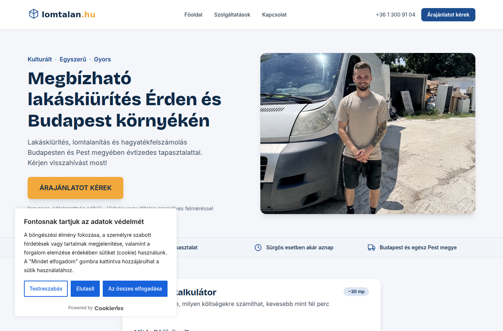
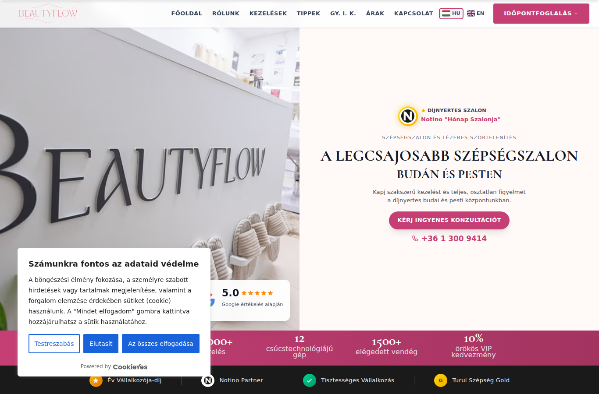
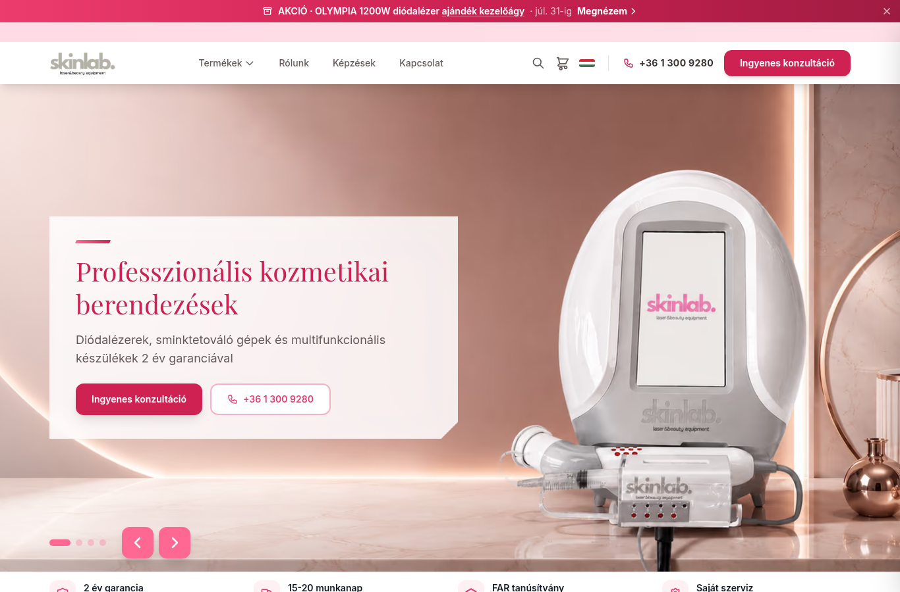
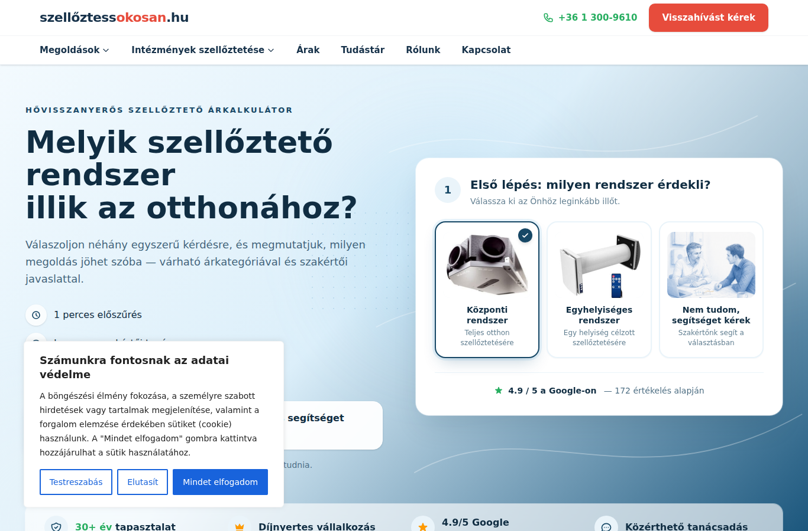
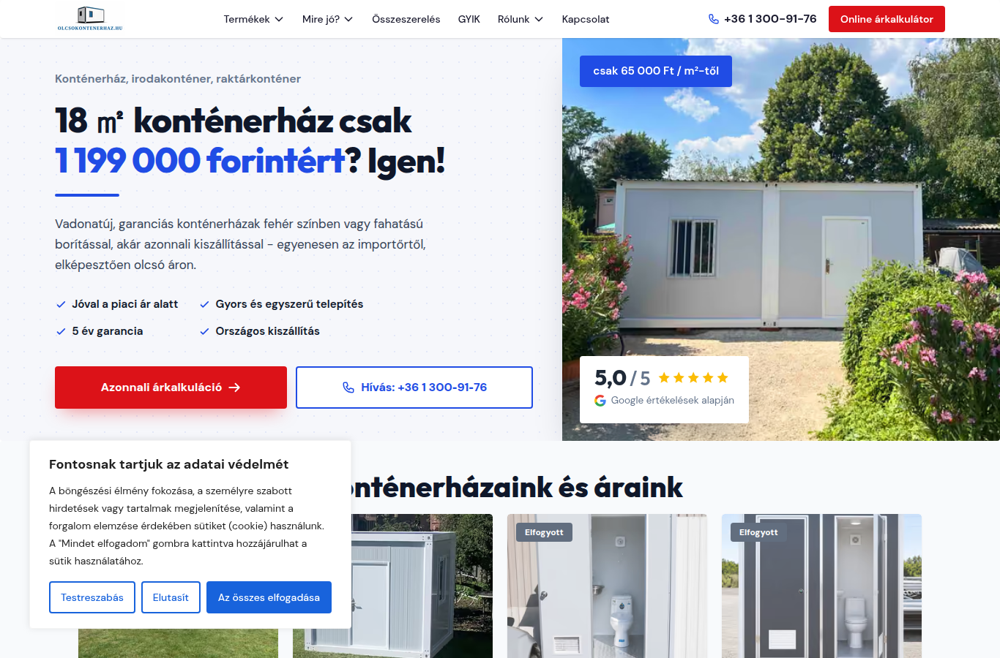
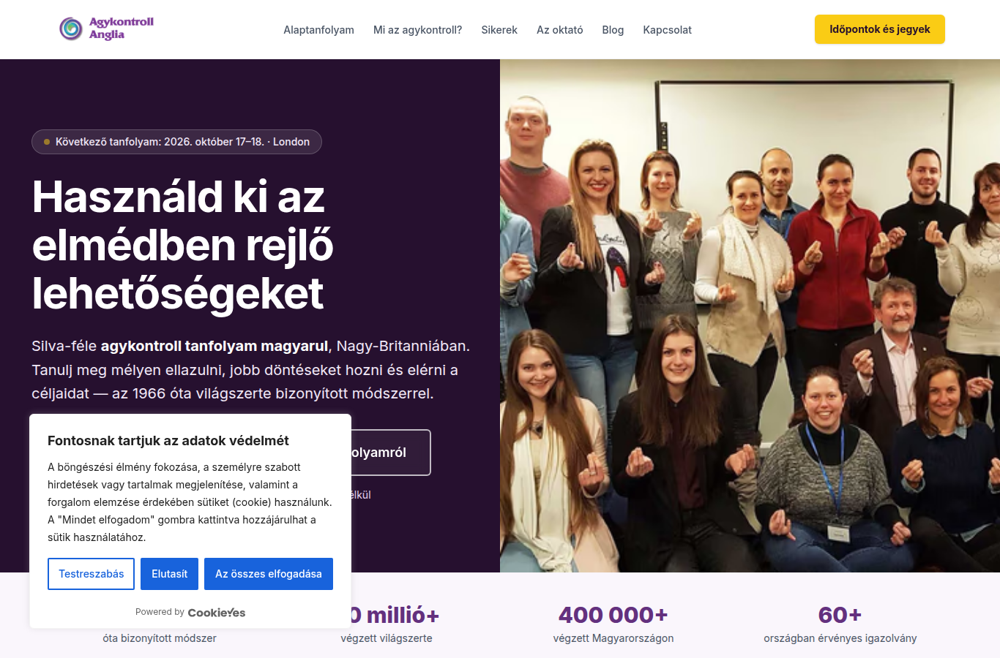
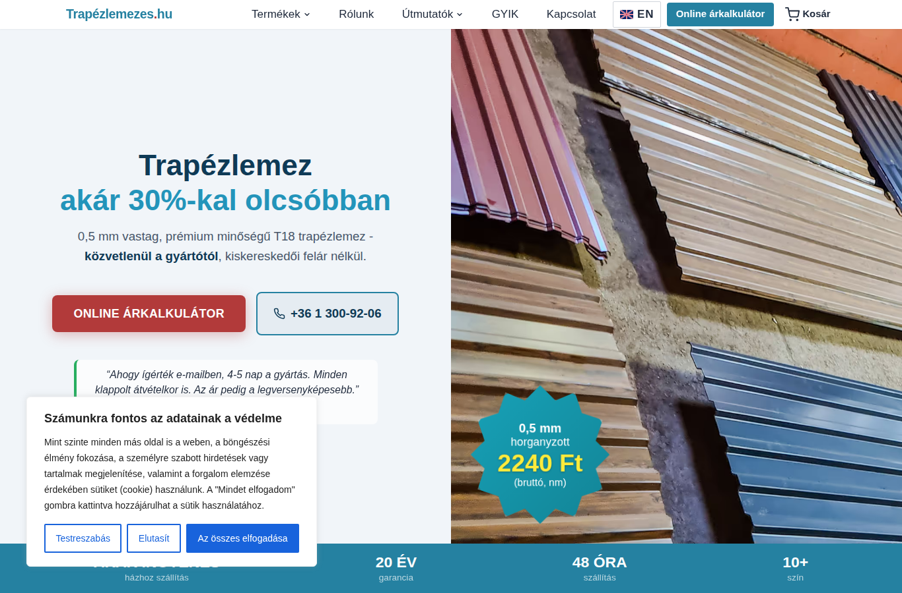
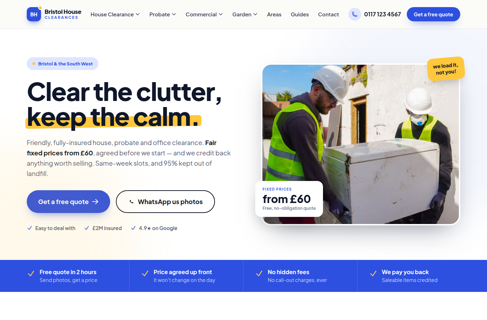

# Consent compliance baseline

**Futás:** `npm run compliance -- --browser=chromium --relay`  
**Kezdet:** 2026-08-17T07:02:58.471Z · **Vége:** 2026-08-17T07:08:12.263Z  
**Böngészők:** chromium  
**Teszt-IP országa:** US — a banner megjelenése geo-függő lehet.

> **Relay-mód volt bekapcsolva.** A böngésző kéréseit a futtató Node HTTP-stackje szolgálta ki (a mérés környezetében a böngésző közvetlenül nem jut ki a hálózatra). Minden kérés ugyanúgy megjelenik a felvételben — csak a válasz jön máshonnan. Ami emiatt NEM mérhető pontosan: a HTTP/2–3 és TLS-szintű viselkedés, valamint a böngésző saját protokoll-optimalizációi.

> Ez MÉRÉS, nem javítás. A harness kizárólag olvas és megfigyel: egyetlen űrlapot sem küld be, egyetlen konverziót sem vált ki (a first-party nem-GET kéréseket hálózati szinten abortálja, a submit-eseményeket a DOM-ban blokkolja, és csak a consent-banner gombjaira kattint).

## Áttekintés

| Site | A: nincs tag consent előtt | A: GTM nem tölt | A: nincs süti | A: nincs storage-írás | A: nincs storage-olvasás | A: nincs noscript iframe | UI: van reject | UI: egyenrangú | UI: 1 kattintás | C: nincs tag reject után | C: nincs süti reject után | C: ping azonosító nélkül | D: visszavonás töröl |
|---|---|---|---|---|---|---|---|---|---|---|---|---|---|
| `painless` (chromium) | ❌ | ❌ | ❌ | ✅ | ✅ | ❌ | ✅ | ✅ | ✅ | ✅ | ❌ | – | – |
| `lomtalan` (chromium) | ❌ | ❌ | ✅ | ✅ | ✅ | ❌ | ✅ | ❌ | ✅ | ✅ | ✅ | – | – |
| `beautyflow` (chromium) | ❌ | ❌ | ❌ | ✅ | ✅ | ❌ | ✅ | ❌ | ✅ | ✅ | ✅ | – | – |
| `skinlab` (chromium) | ❌ | ❌ | ✅ | ✅ | ✅ | ❌ | – | – | – | – | – | – | – |
| `szelloztetes` (chromium) | ❌ | ❌ | ❌ | ✅ | ✅ | ❌ | ✅ | ❌ | ✅ | ✅ | ❌ | – | – |
| `kontenerhaz` (chromium) | ❌ | ❌ | ✅ | ✅ | ✅ | ❌ | ✅ | ❌ | ✅ | ✅ | ✅ | – | – |
| `agykontroll` (chromium) | ❌ | ❌ | ✅ | ✅ | ✅ | ❌ | ✅ | ❌ | ✅ | ✅ | ✅ | – | – |
| `trapezlemezes` (chromium) | ❌ | ❌ | ❌ | ✅ | ✅ | ❌ | ✅ | ❌ | ✅ | ✅ | ❌ | – | – |
| `nemesventilatorhaz` (chromium) | ⚠️ | ⚠️ | ⚠️ | ⚠️ | ⚠️ | ⚠️ | ⚠️ | ⚠️ | ⚠️ | ⚠️ | ⚠️ | ⚠️ | ⚠️ |
| `skinlab_hu` (chromium) | ⚠️ | ⚠️ | ⚠️ | ⚠️ | ⚠️ | ⚠️ | ⚠️ | ⚠️ | ⚠️ | ⚠️ | ⚠️ | ⚠️ | ⚠️ |
| `bristolheatpump` (chromium) | ✅ | ❌ | ✅ | ✅ | ✅ | ❌ | – | – | – | – | – | – | – |
| `bristolhouseclearances` (chromium) | ✅ | ✅ | ✅ | ✅ | ✅ | ✅ | – | – | – | – | – | – | – |
| `bristolcleaningheroes` (chromium) | ✅ | ❌ | ✅ | ✅ | ✅ | ❌ | – | – | – | – | – | – | – |

✅ megfelel · ❌ bukik · – nem értelmezhető / nem mérhető · ⚠️ a site mérése hibára futott

## Hány oldal bukik melyik ponton

| Ellenőrzés | ❌ bukik | ✅ megfelel | – n/a |
|---|---:|---:|---:|
| A: nincs tag consent előtt | **8** | 3 | 0 |
| A: GTM nem tölt | **10** | 1 | 0 |
| A: nincs süti | **4** | 7 | 0 |
| A: nincs storage-írás | **0** | 11 | 0 |
| A: nincs storage-olvasás | **0** | 11 | 0 |
| A: nincs noscript iframe | **10** | 1 | 0 |
| UI: van reject | **0** | 7 | 4 |
| UI: egyenrangú | **6** | 1 | 4 |
| UI: 1 kattintás | **0** | 7 | 4 |
| C: nincs tag reject után | **0** | 7 | 4 |
| C: nincs süti reject után | **3** | 4 | 4 |
| C: ping azonosító nélkül | **0** | 0 | 11 |
| D: visszavonás töröl | **0** | 0 | 11 |

## Nem mért site-ok

- `nemesventilatorhaz` (chromium) — page.goto: net::ERR_CONNECTION_RESET at https://nemesventilatorhaz.hu/
Call log:
  - navigating to "https://nemesventilatorhaz.hu/", waiting until "domcontentloaded"

- `skinlab_hu` (chromium) — page.goto: net::ERR_HTTP_RESPONSE_CODE_FAILURE at https://skinlab.hu/
Call log:
  - navigating to "https://skinlab.hu/", waiting until "domcontentloaded"


## A site-manifestben NEM szereplő, mégis mért oldalak

`trapezlemezes`, `nemesventilatorhaz`, `skinlab_hu`, `bristolheatpump`, `bristolhouseclearances`, `bristolcleaningheroes` — a manifestet SZÁNDÉKOSAN nem módosítottuk (ez a harness csak mér).

## Site-részletek

### `painless` · chromium · https://painlessremovals.com/


- ❌ **A_no_consent_bound_requests** — 4 consent-kötött kérés ment döntés ELŐTT.

<details><summary>bizonyíték</summary>

```json
[
  {
    "t": 1786950180416,
    "category": "ga4",
    "method": "POST",
    "url": "painlessremovals.com/f807/ga/g/c",
    "full_url_len": 810
  },
  {
    "t": 1786950180416,
    "category": "ga4",
    "method": "POST",
    "url": "www.google-analytics.com/g/s/collect",
    "full_url_len": 158
  },
  {
    "t": 1786950180418,
    "category": "google_ads",
    "method": "POST",
    "url": "painlessremovals.com/f807/gs/ccm/collect",
    "full_url_len": 523
  },
  {
    "t": 1786950180422,
    "category": "google_ads",
    "method": "GET",
    "url": "painlessremovals.com/f807/gs/ccm/collect",
    "full_url_len": 523
  }
]
```

</details>
- ❌ **A_gtm_not_loaded_before_decision** — A GTM konténer döntés ELŐTT betöltött → nem Basic Consent Mode (advanced / mindig-be állapot).

<details><summary>bizonyíték</summary>

```json
[
  {
    "t": 1786950179865,
    "category": "gtm",
    "method": "GET",
    "url": "www.googletagmanager.com/gtm.js",
    "full_url_len": 68
  }
]
```

</details>
- ❌ **A_no_nonessential_cookies** — 1 nem-esszenciális süti döntés ELŐTT.

<details><summary>bizonyíték</summary>

```json
[
  {
    "name": "CLID",
    "domain": "www.clarity.ms",
    "expires": "2027-08-17T07:03:00.088Z"
  }
]
```

</details>
- ✅ **A_no_nonessential_storage_write** — Nincs nem-esszenciális storage-ÍRÁS.

<details><summary>bizonyíték</summary>

```json
[]
```

</details>
- ✅ **A_no_nonessential_storage_read** — Nincs nem-esszenciális storage-OLVASÁS.

<details><summary>bizonyíték</summary>

```json
[]
```

</details>
- ❌ **A_consent_default_before_gtm** — A GTM betöltött, de a dataLayerben NEM figyeltünk meg `consent default` push-t (a konténeren belüli CMP-sablon is adhatja — ez a mérés korlátja, nem cáfolat).

<details><summary>bizonyíték</summary>

```json
{
  "default_push_t": null,
  "gtm_request_t": 1786950179865,
  "gtm_url": "www.googletagmanager.com/gtm.js",
  "datalayer_sample": [
    {
      "t": 1786950179337,
      "pre": false,
      "args": [
        {
          "0": "set",
          "1": "developer_id.dY2E1Nz",
          "2": true
        }
      ]
    },
    {
      "t": 1786950179338,
      "pre": false,
      "args": [
        {
          "0": "consent",
          "1": "default",
          "2": {
            "ad_storage": "denied",
            "analytics_storage": "denied",
            "ad_user_data": "denied",
            "ad_personalization": "denied",
            "functionality_storage": "denied",
            "personalization_storage": "denied",
            "security_storage": "granted",
            "wait_for_update": 2000
          }
        }
      ]
    },
    {
      "t": 1786950179338,
      "pre": false,
      "args": [
        {
          "gtm.start": 1786950179338,
          "event": "gtm.js"
        }
      ]
    },
    {
      "t": 1786950179867,
      "pre": false,
      "args": [
        {
          "event": "gtm.dom"
        }
      ]
    },
    {
      "t": 1786950180228,
      "pre": false,
      "args": [
        {
          "0": "set",
          "1": "developer_id.dY2Q2ZW",
          "2": true
        }
      ]
    },
    {
      "t": 1786950180229,
      "pre": false,
      "args": [
        {
          "0": "consent",
          "1": "update",
          "2": {
            "ad_storage": "denied",
            "ad_user_data": "denied",
            "ad_personalization": "denied",
            "analytics_storage": "denied",
            "functionality_storage": "denied",
            "personalization_storage": "denied",
            "security_storage": "granted"
          }
        }
      ]
    },
    {
      "t": 1786950180237,
      "pre": false,
      "args": [
        {
          "event": "cookie_consent_update"
        }
      ]
    }
  ]
}
```

</details>
- ❌ **A_noscript_iframe_absent** — A HTML tartalmazza a GTM `ns.html` noscript iframe-et — JS nélkül nincs consent-panel, tehát ez consent nélküli betöltés.

<details><summary>bizonyíték</summary>

```json
{
  "snippet": "<noscript><iframe src=\"https://www.googletagmanager.com/ns.html?id=GTM-PXTH5JJK\" height=\"0\" width=\"0\" style=\"display:none;visibility:hidden\"></iframe></noscript>"
}
```

</details>
- ℹ️ **A_document_cookie_reads** — 20 db `document.cookie` olvasás döntés előtt (a CMP saját olvasásait is tartalmazza — kontextus, nem ítélet).
- ✅ **UI_reject_button_present** — Van elutasító gomb az első rétegen: "Reject All"

<details><summary>bizonyíték</summary>

```json
{
  "text": "Reject All",
  "tag": "button",
  "width": 118,
  "height": 44,
  "area": 5205,
  "font_size_px": 14,
  "font_weight": "500",
  "color": "rgb(24, 99, 220)",
  "background_color": "rgba(0, 0, 0, 0)",
  "border": "2px solid",
  "opacity": 1,
  "selector_source": ".cky-btn-reject"
}
```

</details>
- ✅ **UI_reject_equal_prominence** — Az elfogad/elutasít gomb mérhetően egyenrangú.

<details><summary>bizonyíték</summary>

```json
{
  "comparable": true,
  "area_ratio": 0.95,
  "font_size_ratio": 1,
  "accept_contrast": 5.44,
  "reject_contrast": 3.86,
  "contrast_ratio_of_ratios": 0.71,
  "equal_prominence": true,
  "failures": []
}
```

</details>
- ✅ **UI_clicks_to_reject** — Az elutasítás 1 kattintás az első rétegtől (elvárás: 1, ugyanannyi mint az elfogadás).

<details><summary>bizonyíték</summary>

```json
{
  "clicks": 1
}
```

</details>
- ✅ **MISC_cookie_policy_names_third_parties** — A tájékoztató megnevezi: Google, Meta/Facebook, CookieYes (kulcsszó-keresés, NEM jogi értékelés).

<details><summary>bizonyíték</summary>

```json
{
  "url": "https://www.cookieyes.com/product/cookie-consent/?ref=cypbcyb&utm_source=cookie-banner&utm_medium=powered-by-cookieyes",
  "matched": [
    "Google",
    "Meta/Facebook",
    "CookieYes"
  ]
}
```

</details>
- ✅ **C_no_consent_bound_requests** — Elutasítás után nem ment GA4/Ads/Meta/gateway kérés.

<details><summary>bizonyíték</summary>

```json
[]
```

</details>
- ❌ **C_no_nonessential_cookies** — 1 nem-esszenciális süti elutasítás után.

<details><summary>bizonyíték</summary>

```json
[
  {
    "name": "CLID",
    "domain": "www.clarity.ms",
    "expires": "2027-08-17T07:03:11.801Z"
  }
]
```

</details>
- ✅ **C_no_nonessential_storage_write** — Nincs nem-esszenciális storage-írás.

<details><summary>bizonyíték</summary>

```json
[]
```

</details>
- – **C_pings_carry_no_identifiers** — Nem ment ping elutasítás után — nincs mit vizsgálni.
- – **D_withdrawal_purges** — NO_REVISIT_UI — nincs elérhető visszavonó felület.

### `lomtalan` · chromium · https://lomtalan.hu/



- ❌ **A_no_consent_bound_requests** — 4 consent-kötött kérés ment döntés ELŐTT.

<details><summary>bizonyíték</summary>

```json
[
  {
    "t": 1786950212884,
    "category": "ga4",
    "method": "POST",
    "url": "lomtalan.hu/meres/ga/g/c",
    "full_url_len": 831
  },
  {
    "t": 1786950212885,
    "category": "ga4",
    "method": "POST",
    "url": "www.google-analytics.com/g/s/collect",
    "full_url_len": 157
  },
  {
    "t": 1786950212886,
    "category": "google_ads",
    "method": "POST",
    "url": "lomtalan.hu/meres/gs/ccm/collect",
    "full_url_len": 485
  },
  {
    "t": 1786950212889,
    "category": "google_ads",
    "method": "GET",
    "url": "lomtalan.hu/meres/gs/ccm/collect",
    "full_url_len": 485
  }
]
```

</details>
- ❌ **A_gtm_not_loaded_before_decision** — A GTM konténer döntés ELŐTT betöltött → nem Basic Consent Mode (advanced / mindig-be állapot).

<details><summary>bizonyíték</summary>

```json
[
  {
    "t": 1786950212088,
    "category": "gtm",
    "method": "GET",
    "url": "www.googletagmanager.com/gtm.js",
    "full_url_len": 55
  }
]
```

</details>
- ✅ **A_no_nonessential_cookies** — Döntés előtt nem íródott nem-esszenciális süti.

<details><summary>bizonyíték</summary>

```json
[]
```

</details>
- ✅ **A_no_nonessential_storage_write** — Nincs nem-esszenciális storage-ÍRÁS.

<details><summary>bizonyíték</summary>

```json
[]
```

</details>
- ✅ **A_no_nonessential_storage_read** — Nincs nem-esszenciális storage-OLVASÁS.

<details><summary>bizonyíték</summary>

```json
[]
```

</details>
- ❌ **A_consent_default_before_gtm** — A GTM betöltött, de a dataLayerben NEM figyeltünk meg `consent default` push-t (a konténeren belüli CMP-sablon is adhatja — ez a mérés korlátja, nem cáfolat).

<details><summary>bizonyíték</summary>

```json
{
  "default_push_t": null,
  "gtm_request_t": 1786950212088,
  "gtm_url": "www.googletagmanager.com/gtm.js",
  "datalayer_sample": [
    {
      "t": 1786950212038,
      "pre": false,
      "args": [
        {
          "0": "set",
          "1": "developer_id.dY2E1Nz",
          "2": true
        }
      ]
    },
    {
      "t": 1786950212078,
      "pre": false,
      "args": [
        {
          "0": "consent",
          "1": "default",
          "2": {
            "ad_storage": "denied",
            "ad_user_data": "denied",
            "ad_personalization": "denied",
            "analytics_storage": "denied",
            "functionality_storage": "denied",
            "personalization_storage": "denied",
            "security_storage": "granted",
            "wait_for_update": 2000
          }
        }
      ]
    },
    {
      "t": 1786950212078,
      "pre": false,
      "args": [
        {
          "gtm.start": 1786950212078,
          "event": "gtm.js"
        }
      ]
    },
    {
      "t": 1786950212349,
      "pre": false,
      "args": [
        {
          "0": "set",
          "1": "developer_id.dY2Q2ZW",
          "2": true
        }
      ]
    },
    {
      "t": 1786950212349,
      "pre": false,
      "args": [
        {
          "0": "consent",
          "1": "update",
          "2": {
            "ad_storage": "denied",
            "ad_user_data": "denied",
            "ad_personalization": "denied",
            "analytics_storage": "denied",
            "functionality_storage": "denied",
            "personalization_storage": "denied",
            "security_storage": "granted"
          }
        }
      ]
    },
    {
      "t": 1786950212349,
      "pre": false,
      "args": [
        {
          "event": "cookie_consent_update"
        }
      ]
    },
    {
      "t": 1786950212563,
      "pre": false,
      "args": [
        {
          "event": "gtm.dom"
        }
      ]
    }
  ]
}
```

</details>
- ❌ **A_noscript_iframe_absent** — A HTML tartalmazza a GTM `ns.html` noscript iframe-et — JS nélkül nincs consent-panel, tehát ez consent nélküli betöltés.

<details><summary>bizonyíték</summary>

```json
{
  "snippet": "<noscript><iframe src=\"https://www.googletagmanager.com/ns.html?id=GTM-P5D2P8RT\" height=\"0\" width=\"0\" style=\"display:none;visibility:hidden\"></iframe></noscript>"
}
```

</details>
- ℹ️ **A_document_cookie_reads** — 16 db `document.cookie` olvasás döntés előtt (a CMP saját olvasásait is tartalmazza — kontextus, nem ítélet).
- ✅ **UI_reject_button_present** — Van elutasító gomb az első rétegen: "Elutasít"

<details><summary>bizonyíték</summary>

```json
{
  "text": "Elutasít",
  "tag": "button",
  "width": 79,
  "height": 44,
  "area": 3468,
  "font_size_px": 14,
  "font_weight": "500",
  "color": "rgb(255, 255, 255)",
  "background_color": "rgb(24, 99, 220)",
  "border": "2px solid",
  "opacity": 1,
  "selector_source": ".cky-btn-reject"
}
```

</details>
- ❌ **UI_reject_equal_prominence** — Az elutasítás vizuálisan hátrébb sorolt: reject/accept terület = 0.45

<details><summary>bizonyíték</summary>

```json
{
  "comparable": true,
  "area_ratio": 0.45,
  "font_size_ratio": 1,
  "accept_contrast": 5.44,
  "reject_contrast": 5.44,
  "contrast_ratio_of_ratios": 1,
  "equal_prominence": false,
  "failures": [
    "reject/accept terület = 0.45"
  ]
}
```

</details>
- ✅ **UI_clicks_to_reject** — Az elutasítás 1 kattintás az első rétegtől (elvárás: 1, ugyanannyi mint az elfogadás).

<details><summary>bizonyíték</summary>

```json
{
  "clicks": 1
}
```

</details>
- ✅ **MISC_cookie_policy_names_third_parties** — A tájékoztató megnevezi: Google, Meta/Facebook, CookieYes (kulcsszó-keresés, NEM jogi értékelés).

<details><summary>bizonyíték</summary>

```json
{
  "url": "https://www.cookieyes.com/product/cookie-consent/?ref=cypbcyb&utm_source=cookie-banner&utm_medium=fl-branding",
  "matched": [
    "Google",
    "Meta/Facebook",
    "CookieYes"
  ]
}
```

</details>
- ✅ **C_no_consent_bound_requests** — Elutasítás után nem ment GA4/Ads/Meta/gateway kérés.

<details><summary>bizonyíték</summary>

```json
[]
```

</details>
- ✅ **C_no_nonessential_cookies** — Elutasítás után nincs nem-esszenciális süti.

<details><summary>bizonyíték</summary>

```json
[]
```

</details>
- ✅ **C_no_nonessential_storage_write** — Nincs nem-esszenciális storage-írás.

<details><summary>bizonyíték</summary>

```json
[]
```

</details>
- – **C_pings_carry_no_identifiers** — Nem ment ping elutasítás után — nincs mit vizsgálni.
- – **D_withdrawal_purges** — NO_REVISIT_UI — nincs elérhető visszavonó felület.

### `beautyflow` · chromium · https://beautyflow.pro/



- ❌ **A_no_consent_bound_requests** — 6 consent-kötött kérés ment döntés ELŐTT.

<details><summary>bizonyíték</summary>

```json
[
  {
    "t": 1786950243770,
    "category": "google_ads",
    "method": "POST",
    "url": "www.google.com/ccm/collect",
    "full_url_len": 548
  },
  {
    "t": 1786950243771,
    "category": "google_ads",
    "method": "POST",
    "url": "ad.doubleclick.net/ccm/s/collect",
    "full_url_len": 119
  },
  {
    "t": 1786950244183,
    "category": "ga4",
    "method": "POST",
    "url": "beautyflow.pro/i9xo/ga/g/c",
    "full_url_len": 839
  },
  {
    "t": 1786950244184,
    "category": "ga4",
    "method": "POST",
    "url": "www.google-analytics.com/g/s/collect",
    "full_url_len": 156
  },
  {
    "t": 1786950244185,
    "category": "google_ads",
    "method": "POST",
    "url": "beautyflow.pro/i9xo/gs/ccm/collect",
    "full_url_len": 488
  },
  {
    "t": 1786950244188,
    "category": "google_ads",
    "method": "GET",
    "url": "beautyflow.pro/i9xo/gs/ccm/collect",
    "full_url_len": 488
  }
]
```

</details>
- ❌ **A_gtm_not_loaded_before_decision** — A GTM konténer döntés ELŐTT betöltött → nem Basic Consent Mode (advanced / mindig-be állapot).

<details><summary>bizonyíték</summary>

```json
[
  {
    "t": 1786950243395,
    "category": "gtm",
    "method": "GET",
    "url": "www.googletagmanager.com/gtm.js",
    "full_url_len": 55
  }
]
```

</details>
- ❌ **A_no_nonessential_cookies** — 1 nem-esszenciális süti döntés ELŐTT.

<details><summary>bizonyíték</summary>

```json
[
  {
    "name": "_gcl_au",
    "domain": ".beautyflow.pro",
    "expires": "2026-11-15T07:04:03.000Z"
  }
]
```

</details>
- ✅ **A_no_nonessential_storage_write** — Nincs nem-esszenciális storage-ÍRÁS.

<details><summary>bizonyíték</summary>

```json
[]
```

</details>
- ✅ **A_no_nonessential_storage_read** — Nincs nem-esszenciális storage-OLVASÁS.

<details><summary>bizonyíték</summary>

```json
[]
```

</details>
- ❌ **A_consent_default_before_gtm** — A GTM betöltött, de a dataLayerben NEM figyeltünk meg `consent default` push-t (a konténeren belüli CMP-sablon is adhatja — ez a mérés korlátja, nem cáfolat).

<details><summary>bizonyíték</summary>

```json
{
  "default_push_t": null,
  "gtm_request_t": 1786950243395,
  "gtm_url": "www.googletagmanager.com/gtm.js",
  "datalayer_sample": [
    {
      "t": 1786950243343,
      "pre": false,
      "args": [
        {
          "0": "set",
          "1": "developer_id.dYzg1YT",
          "2": true
        }
      ]
    },
    {
      "t": 1786950243343,
      "pre": false,
      "args": [
        {
          "gtm.start": 1786950243343,
          "event": "gtm.js"
        }
      ]
    },
    {
      "t": 1786950243344,
      "pre": false,
      "args": [
        {
          "0": "consent",
          "1": "default",
          "2": {
            "ad_storage": "denied",
            "ad_user_data": "denied",
            "ad_personalization": "denied",
            "analytics_storage": "denied",
            "functionality_storage": "denied",
            "personalization_storage": "denied",
            "security_storage": "granted",
            "wait_for_update": 2000
          }
        }
      ]
    },
    {
      "t": 1786950243384,
      "pre": false,
      "args": [
        {
          "gtm.start": 1786950243384,
          "event": "gtm.js"
        }
      ]
    },
    {
      "t": 1786950243616,
      "pre": false,
      "args": [
        {
          "0": "set",
          "1": "developer_id.dY2Q2ZW",
          "2": true
        }
      ]
    },
    {
      "t": 1786950243616,
      "pre": false,
      "args": [
        {
          "0": "consent",
          "1": "update",
          "2": {
            "ad_storage": "denied",
            "ad_user_data": "denied",
            "ad_personalization": "denied",
            "analytics_storage": "denied",
            "functionality_storage": "denied",
            "personalization_storage": "denied",
            "security_storage": "granted"
          }
        }
      ]
    },
    {
      "t": 1786950243616,
      "pre": false,
      "args": [
        {
          "event": "cookie_consent_update"
        }
      ]
    },
    {
      "t": 1786950243766,
      "pre": false,
      "args": [
        {
          "event": "gtm.dom"
        }
      ]
    }
  ]
}
```

</details>
- ❌ **A_noscript_iframe_absent** — A HTML tartalmazza a GTM `ns.html` noscript iframe-et — JS nélkül nincs consent-panel, tehát ez consent nélküli betöltés.

<details><summary>bizonyíték</summary>

```json
{
  "snippet": "<noscript><iframe src=\"https://www.googletagmanager.com/ns.html?id=GTM-W8V3BVGD\" height=\"0\" width=\"0\" style=\"display:none;visibility:hidden\"></iframe></noscript>"
}
```

</details>
- ℹ️ **A_document_cookie_reads** — 32 db `document.cookie` olvasás döntés előtt (a CMP saját olvasásait is tartalmazza — kontextus, nem ítélet).
- ✅ **UI_reject_button_present** — Van elutasító gomb az első rétegen: "Elutasít"

<details><summary>bizonyíték</summary>

```json
{
  "text": "Elutasít",
  "tag": "button",
  "width": 80,
  "height": 44,
  "area": 3521,
  "font_size_px": 14,
  "font_weight": "500",
  "color": "rgb(255, 255, 255)",
  "background_color": "rgb(24, 99, 220)",
  "border": "2px solid",
  "opacity": 1,
  "selector_source": ".cky-btn-reject"
}
```

</details>
- ❌ **UI_reject_equal_prominence** — Az elutasítás vizuálisan hátrébb sorolt: reject/accept terület = 0.45

<details><summary>bizonyíték</summary>

```json
{
  "comparable": true,
  "area_ratio": 0.45,
  "font_size_ratio": 1,
  "accept_contrast": 5.44,
  "reject_contrast": 5.44,
  "contrast_ratio_of_ratios": 1,
  "equal_prominence": false,
  "failures": [
    "reject/accept terület = 0.45"
  ]
}
```

</details>
- ✅ **UI_clicks_to_reject** — Az elutasítás 1 kattintás az első rétegtől (elvárás: 1, ugyanannyi mint az elfogadás).

<details><summary>bizonyíték</summary>

```json
{
  "clicks": 1
}
```

</details>
- ✅ **MISC_cookie_policy_names_third_parties** — A tájékoztató megnevezi: Google, Meta/Facebook, CookieYes (kulcsszó-keresés, NEM jogi értékelés).

<details><summary>bizonyíték</summary>

```json
{
  "url": "https://www.cookieyes.com/product/cookie-consent/?ref=cypbcyb&utm_source=cookie-banner&utm_medium=fl-branding",
  "matched": [
    "Google",
    "Meta/Facebook",
    "CookieYes"
  ]
}
```

</details>
- ✅ **C_no_consent_bound_requests** — Elutasítás után nem ment GA4/Ads/Meta/gateway kérés.

<details><summary>bizonyíték</summary>

```json
[]
```

</details>
- ✅ **C_no_nonessential_cookies** — Elutasítás után nincs nem-esszenciális süti.

<details><summary>bizonyíték</summary>

```json
[]
```

</details>
- ✅ **C_no_nonessential_storage_write** — Nincs nem-esszenciális storage-írás.

<details><summary>bizonyíték</summary>

```json
[]
```

</details>
- – **C_pings_carry_no_identifiers** — Nem ment ping elutasítás után — nincs mit vizsgálni.
- – **D_withdrawal_purges** — NO_REVISIT_UI — nincs elérhető visszavonó felület.

### `skinlab` · chromium · https://skinlabhungary.hu/

**NO_BANNER_OBSERVED** — nem láttunk bannert (teszt-ország: US). Ez nem bizonyítja, hogy nincs CMP.



- ❌ **A_no_consent_bound_requests** — 2 consent-kötött kérés ment döntés ELŐTT.

<details><summary>bizonyíték</summary>

```json
[
  {
    "t": 1786950277253,
    "category": "ga4",
    "method": "POST",
    "url": "skinlabhungary.hu/meres/ga/g/c",
    "full_url_len": 830
  },
  {
    "t": 1786950277253,
    "category": "ga4",
    "method": "POST",
    "url": "www.google-analytics.com/g/s/collect",
    "full_url_len": 156
  }
]
```

</details>
- ❌ **A_gtm_not_loaded_before_decision** — A GTM konténer döntés ELŐTT betöltött → nem Basic Consent Mode (advanced / mindig-be állapot).

<details><summary>bizonyíték</summary>

```json
[
  {
    "t": 1786950274493,
    "category": "gtm",
    "method": "GET",
    "url": "www.googletagmanager.com/gtm.js",
    "full_url_len": 55
  }
]
```

</details>
- ✅ **A_no_nonessential_cookies** — Döntés előtt nem íródott nem-esszenciális süti.

<details><summary>bizonyíték</summary>

```json
[]
```

</details>
- ✅ **A_no_nonessential_storage_write** — Nincs nem-esszenciális storage-ÍRÁS.

<details><summary>bizonyíték</summary>

```json
[]
```

</details>
- ✅ **A_no_nonessential_storage_read** — Nincs nem-esszenciális storage-OLVASÁS.

<details><summary>bizonyíték</summary>

```json
[]
```

</details>
- ❌ **A_consent_default_before_gtm** — A GTM betöltött, de a dataLayerben NEM figyeltünk meg `consent default` push-t (a konténeren belüli CMP-sablon is adhatja — ez a mérés korlátja, nem cáfolat).

<details><summary>bizonyíték</summary>

```json
{
  "default_push_t": null,
  "gtm_request_t": 1786950274493,
  "gtm_url": "www.googletagmanager.com/gtm.js",
  "datalayer_sample": [
    {
      "t": 1786950274444,
      "pre": false,
      "args": [
        {
          "0": "set",
          "1": "developer_id.dY2E1Nz",
          "2": true
        }
      ]
    },
    {
      "t": 1786950274482,
      "pre": false,
      "args": [
        {
          "0": "consent",
          "1": "default",
          "2": {
            "ad_storage": "denied",
            "ad_user_data": "denied",
            "ad_personalization": "denied",
            "analytics_storage": "denied",
            "functionality_storage": "denied",
            "personalization_storage": "denied",
            "security_storage": "granted",
            "wait_for_update": 2000
          }
        }
      ]
    },
    {
      "t": 1786950274482,
      "pre": false,
      "args": [
        {
          "gtm.start": 1786950274482,
          "event": "gtm.js"
        }
      ]
    },
    {
      "t": 1786950274893,
      "pre": false,
      "args": [
        {
          "event": "gtm.dom"
        }
      ]
    },
    {
      "t": 1786950275235,
      "pre": false,
      "args": [
        {
          "event": "gtm.load"
        }
      ]
    }
  ]
}
```

</details>
- ❌ **A_noscript_iframe_absent** — A HTML tartalmazza a GTM `ns.html` noscript iframe-et — JS nélkül nincs consent-panel, tehát ez consent nélküli betöltés.

<details><summary>bizonyíték</summary>

```json
{
  "snippet": "<noscript> <iframe src=\"https://www.googletagmanager.com/ns.html?id=GTM-NW7DKC2D\" height=\"0\" width=\"0\" style=\"display:none;visibility:hidden\"></iframe> </noscript>"
}
```

</details>
- ℹ️ **A_document_cookie_reads** — 10 db `document.cookie` olvasás döntés előtt (a CMP saját olvasásait is tartalmazza — kontextus, nem ítélet).
- – **UI_reject_button_present** — NO_BANNER_OBSERVED — nem láttunk bannert. Ez NEM bizonyítja, hogy nincs CMP: lehet geo-alapú megjelenítés (lásd a riport teszt-ország mezőjét).
- – **UI_reject_equal_prominence** — NO_BANNER_OBSERVED — nem láttunk bannert. Ez NEM bizonyítja, hogy nincs CMP: lehet geo-alapú megjelenítés (lásd a riport teszt-ország mezőjét).
- – **UI_clicks_to_reject** — NO_BANNER_OBSERVED — nem láttunk bannert. Ez NEM bizonyítja, hogy nincs CMP: lehet geo-alapú megjelenítés (lásd a riport teszt-ország mezőjét).
- ✅ **MISC_cookie_policy_names_third_parties** — A tájékoztató megnevezi: Google, Meta/Facebook, CookieYes (kulcsszó-keresés, NEM jogi értékelés).

<details><summary>bizonyíték</summary>

```json
{
  "url": "https://skinlabhungary.hu/adatvedelem/",
  "matched": [
    "Google",
    "Meta/Facebook",
    "CookieYes"
  ]
}
```

</details>
- – **C_no_consent_bound_requests** — Nem volt elutasító gomb, amire kattinthattunk volna — a C forgatókönyv nem futott le.
- – **C_no_nonessential_cookies** — Nem volt elutasító gomb, amire kattinthattunk volna — a C forgatókönyv nem futott le.
- – **C_no_nonessential_storage_write** — Nem volt elutasító gomb, amire kattinthattunk volna — a C forgatókönyv nem futott le.
- – **C_pings_carry_no_identifiers** — Nem volt elutasító gomb, amire kattinthattunk volna — a C forgatókönyv nem futott le.
- – **D_withdrawal_purges** — NO_ACCEPT_BUTTON — nem tudtunk consentet adni, tehát visszavonni sem.

### `szelloztetes` · chromium · https://szelloztessokosan.hu/



- ❌ **A_no_consent_bound_requests** — 4 consent-kötött kérés ment döntés ELŐTT.

<details><summary>bizonyíték</summary>

```json
[
  {
    "t": 1786950294352,
    "category": "ga4",
    "method": "POST",
    "url": "szelloztessokosan.hu/fdok/ga/g/c",
    "full_url_len": 876
  },
  {
    "t": 1786950294353,
    "category": "ga4",
    "method": "POST",
    "url": "www.google-analytics.com/g/s/collect",
    "full_url_len": 156
  },
  {
    "t": 1786950294354,
    "category": "google_ads",
    "method": "POST",
    "url": "szelloztessokosan.hu/fdok/gs/ccm/collect",
    "full_url_len": 530
  },
  {
    "t": 1786950294359,
    "category": "google_ads",
    "method": "GET",
    "url": "szelloztessokosan.hu/fdok/gs/ccm/collect",
    "full_url_len": 530
  }
]
```

</details>
- ❌ **A_gtm_not_loaded_before_decision** — A GTM konténer döntés ELŐTT betöltött → nem Basic Consent Mode (advanced / mindig-be állapot).

<details><summary>bizonyíték</summary>

```json
[
  {
    "t": 1786950293905,
    "category": "gtm",
    "method": "GET",
    "url": "www.googletagmanager.com/gtm.js",
    "full_url_len": 68
  }
]
```

</details>
- ❌ **A_no_nonessential_cookies** — 3 nem-esszenciális süti döntés ELŐTT.

<details><summary>bizonyíték</summary>

```json
[
  {
    "name": "CLID",
    "domain": "www.clarity.ms",
    "expires": "2027-08-17T07:04:53.981Z"
  },
  {
    "name": "SM",
    "domain": ".c.clarity.ms",
    "expires": "session"
  },
  {
    "name": "MUID",
    "domain": ".clarity.ms",
    "expires": "2027-09-11T07:04:54.609Z"
  }
]
```

</details>
- ✅ **A_no_nonessential_storage_write** — Nincs nem-esszenciális storage-ÍRÁS.

<details><summary>bizonyíték</summary>

```json
[]
```

</details>
- ✅ **A_no_nonessential_storage_read** — Nincs nem-esszenciális storage-OLVASÁS.

<details><summary>bizonyíték</summary>

```json
[]
```

</details>
- ❌ **A_consent_default_before_gtm** — A GTM betöltött, de a dataLayerben NEM figyeltünk meg `consent default` push-t (a konténeren belüli CMP-sablon is adhatja — ez a mérés korlátja, nem cáfolat).

<details><summary>bizonyíték</summary>

```json
{
  "default_push_t": null,
  "gtm_request_t": 1786950293905,
  "gtm_url": "www.googletagmanager.com/gtm.js",
  "datalayer_sample": [
    {
      "t": 1786950293084,
      "pre": false,
      "args": [
        {
          "0": "set",
          "1": "developer_id.dYzg1YT",
          "2": true
        }
      ]
    },
    {
      "t": 1786950293084,
      "pre": false,
      "args": [
        {
          "gtm.start": 1786950293084,
          "event": "gtm.js"
        }
      ]
    },
    {
      "t": 1786950293901,
      "pre": false,
      "args": [
        {
          "event": "gtm.dom"
        }
      ]
    },
    {
      "t": 1786950294216,
      "pre": false,
      "args": [
        {
          "0": "set",
          "1": "developer_id.dY2Q2ZW",
          "2": true
        }
      ]
    },
    {
      "t": 1786950294216,
      "pre": false,
      "args": [
        {
          "0": "consent",
          "1": "update",
          "2": {
            "ad_storage": "denied",
            "ad_user_data": "denied",
            "ad_personalization": "denied",
            "analytics_storage": "denied",
            "functionality_storage": "denied",
            "personalization_storage": "denied",
            "security_storage": "granted"
          }
        }
      ]
    },
    {
      "t": 1786950294228,
      "pre": false,
      "args": [
        {
          "event": "cookie_consent_update"
        }
      ]
    },
    {
      "t": 1786950294358,
      "pre": false,
      "args": [
        {
          "event": "gtm.load"
        }
      ]
    },
    {
      "t": 1786950295086,
      "pre": false,
      "args": [
        {
          "gtm.start": 1786950295085,
          "event": "gtm.js"
        }
      ]
    }
  ]
}
```

</details>
- ❌ **A_noscript_iframe_absent** — A HTML tartalmazza a GTM `ns.html` noscript iframe-et — JS nélkül nincs consent-panel, tehát ez consent nélküli betöltés.

<details><summary>bizonyíték</summary>

```json
{
  "snippet": "<noscript><iframe src=\"https://www.googletagmanager.com/ns.html?id=GTM-KWDMHGBX\" height=\"0\" width=\"0\" style=\"display:none;visibility:hidden\"></iframe></noscript>"
}
```

</details>
- ℹ️ **A_document_cookie_reads** — 34 db `document.cookie` olvasás döntés előtt (a CMP saját olvasásait is tartalmazza — kontextus, nem ítélet).
- ✅ **UI_reject_button_present** — Van elutasító gomb az első rétegen: "Elutasít"

<details><summary>bizonyíték</summary>

```json
{
  "text": "Elutasít",
  "tag": "button",
  "width": 86,
  "height": 44,
  "area": 3787,
  "font_size_px": 14,
  "font_weight": "500",
  "color": "rgb(24, 99, 220)",
  "background_color": "rgba(0, 0, 0, 0)",
  "border": "2px solid",
  "opacity": 1,
  "selector_source": ".cky-btn-reject"
}
```

</details>
- ❌ **UI_reject_equal_prominence** — Az elutasítás vizuálisan hátrébb sorolt: reject/accept terület = 0.54

<details><summary>bizonyíték</summary>

```json
{
  "comparable": true,
  "area_ratio": 0.54,
  "font_size_ratio": 1,
  "accept_contrast": 5.44,
  "reject_contrast": 3.86,
  "contrast_ratio_of_ratios": 0.71,
  "equal_prominence": false,
  "failures": [
    "reject/accept terület = 0.54"
  ]
}
```

</details>
- ✅ **UI_clicks_to_reject** — Az elutasítás 1 kattintás az első rétegtől (elvárás: 1, ugyanannyi mint az elfogadás).

<details><summary>bizonyíték</summary>

```json
{
  "clicks": 1
}
```

</details>
- ✅ **MISC_cookie_policy_names_third_parties** — A tájékoztató megnevezi: Google, Meta/Facebook, CookieYes (kulcsszó-keresés, NEM jogi értékelés).

<details><summary>bizonyíték</summary>

```json
{
  "url": "https://www.cookieyes.com/product/cookie-consent/?ref=cypbcyb&utm_source=cookie-banner&utm_medium=powered-by-cookieyes",
  "matched": [
    "Google",
    "Meta/Facebook",
    "CookieYes"
  ]
}
```

</details>
- ✅ **C_no_consent_bound_requests** — Elutasítás után nem ment GA4/Ads/Meta/gateway kérés.

<details><summary>bizonyíték</summary>

```json
[]
```

</details>
- ❌ **C_no_nonessential_cookies** — 3 nem-esszenciális süti elutasítás után.

<details><summary>bizonyíték</summary>

```json
[
  {
    "name": "CLID",
    "domain": "www.clarity.ms",
    "expires": "2027-08-17T07:05:05.867Z"
  },
  {
    "name": "SM",
    "domain": ".c.clarity.ms",
    "expires": "session"
  },
  {
    "name": "MUID",
    "domain": ".clarity.ms",
    "expires": "2027-09-11T07:05:06.059Z"
  }
]
```

</details>
- ✅ **C_no_nonessential_storage_write** — Nincs nem-esszenciális storage-írás.

<details><summary>bizonyíték</summary>

```json
[]
```

</details>
- – **C_pings_carry_no_identifiers** — Nem ment ping elutasítás után — nincs mit vizsgálni.
- – **D_withdrawal_purges** — NO_REVISIT_UI — nincs elérhető visszavonó felület.

### `kontenerhaz` · chromium · https://olcsokontenerhaz.hu/



- ❌ **A_no_consent_bound_requests** — 6 consent-kötött kérés ment döntés ELŐTT.

<details><summary>bizonyíték</summary>

```json
[
  {
    "t": 1786950325677,
    "category": "google_ads",
    "method": "POST",
    "url": "www.google.com/ccm/collect",
    "full_url_len": 573
  },
  {
    "t": 1786950325678,
    "category": "google_ads",
    "method": "POST",
    "url": "ad.doubleclick.net/ccm/s/collect",
    "full_url_len": 118
  },
  {
    "t": 1786950326003,
    "category": "ga4",
    "method": "POST",
    "url": "olcsokontenerhaz.hu/analitika/ga/g/c",
    "full_url_len": 857
  },
  {
    "t": 1786950326003,
    "category": "ga4",
    "method": "POST",
    "url": "www.google-analytics.com/g/s/collect",
    "full_url_len": 156
  },
  {
    "t": 1786950326052,
    "category": "google_ads",
    "method": "POST",
    "url": "olcsokontenerhaz.hu/analitika/gs/ccm/collect",
    "full_url_len": 527
  },
  {
    "t": 1786950326056,
    "category": "google_ads",
    "method": "GET",
    "url": "olcsokontenerhaz.hu/analitika/gs/ccm/collect",
    "full_url_len": 527
  }
]
```

</details>
- ❌ **A_gtm_not_loaded_before_decision** — A GTM konténer döntés ELŐTT betöltött → nem Basic Consent Mode (advanced / mindig-be állapot).

<details><summary>bizonyíték</summary>

```json
[
  {
    "t": 1786950325313,
    "category": "gtm",
    "method": "GET",
    "url": "www.googletagmanager.com/gtm.js",
    "full_url_len": 55
  }
]
```

</details>
- ✅ **A_no_nonessential_cookies** — Döntés előtt nem íródott nem-esszenciális süti.

<details><summary>bizonyíték</summary>

```json
[]
```

</details>
- ✅ **A_no_nonessential_storage_write** — Nincs nem-esszenciális storage-ÍRÁS.

<details><summary>bizonyíték</summary>

```json
[]
```

</details>
- ✅ **A_no_nonessential_storage_read** — Nincs nem-esszenciális storage-OLVASÁS.

<details><summary>bizonyíték</summary>

```json
[]
```

</details>
- ❌ **A_consent_default_before_gtm** — A GTM betöltött, de a dataLayerben NEM figyeltünk meg `consent default` push-t (a konténeren belüli CMP-sablon is adhatja — ez a mérés korlátja, nem cáfolat).

<details><summary>bizonyíték</summary>

```json
{
  "default_push_t": null,
  "gtm_request_t": 1786950325313,
  "gtm_url": "www.googletagmanager.com/gtm.js",
  "datalayer_sample": [
    {
      "t": 1786950325248,
      "pre": false,
      "args": [
        {
          "0": "set",
          "1": "developer_id.dYzg1YT",
          "2": true
        }
      ]
    },
    {
      "t": 1786950325248,
      "pre": false,
      "args": [
        {
          "gtm.start": 1786950325248,
          "event": "gtm.js"
        }
      ]
    },
    {
      "t": 1786950325292,
      "pre": false,
      "args": [
        {
          "0": "consent",
          "1": "default",
          "2": {
            "ad_storage": "denied",
            "ad_user_data": "denied",
            "ad_personalization": "denied",
            "analytics_storage": "denied",
            "functionality_storage": "denied",
            "personalization_storage": "denied",
            "security_storage": "granted",
            "wait_for_update": 2000
          }
        }
      ]
    },
    {
      "t": 1786950325292,
      "pre": false,
      "args": [
        {
          "gtm.start": 1786950325292,
          "event": "gtm.js"
        }
      ]
    },
    {
      "t": 1786950325674,
      "pre": false,
      "args": [
        {
          "event": "gtm.dom"
        }
      ]
    },
    {
      "t": 1786950325725,
      "pre": false,
      "args": [
        {
          "0": "set",
          "1": "developer_id.dY2Q2ZW",
          "2": true
        }
      ]
    },
    {
      "t": 1786950325725,
      "pre": false,
      "args": [
        {
          "0": "consent",
          "1": "update",
          "2": {
            "ad_storage": "denied",
            "ad_user_data": "denied",
            "ad_personalization": "denied",
            "analytics_storage": "denied",
            "functionality_storage": "denied",
            "personalization_storage": "denied",
            "security_storage": "granted"
          }
        }
      ]
    },
    {
      "t": 1786950325726,
      "pre": false,
      "args": [
        {
          "event": "cookie_consent_update"
        }
      ]
    }
  ]
}
```

</details>
- ❌ **A_noscript_iframe_absent** — A HTML tartalmazza a GTM `ns.html` noscript iframe-et — JS nélkül nincs consent-panel, tehát ez consent nélküli betöltés.

<details><summary>bizonyíték</summary>

```json
{
  "snippet": "<noscript><iframe src=\"https://www.googletagmanager.com/ns.html?id=GTM-5DQH5CD5\" height=\"0\" width=\"0\" style=\"display:none;visibility:hidden\"></iframe></noscript>"
}
```

</details>
- ℹ️ **A_document_cookie_reads** — 34 db `document.cookie` olvasás döntés előtt (a CMP saját olvasásait is tartalmazza — kontextus, nem ítélet).
- ✅ **UI_reject_button_present** — Van elutasító gomb az első rétegen: "Elutasít"

<details><summary>bizonyíték</summary>

```json
{
  "text": "Elutasít",
  "tag": "button",
  "width": 81,
  "height": 44,
  "area": 3565,
  "font_size_px": 14,
  "font_weight": "500",
  "color": "rgb(24, 99, 220)",
  "background_color": "rgba(0, 0, 0, 0)",
  "border": "2px solid",
  "opacity": 1,
  "selector_source": ".cky-btn-reject"
}
```

</details>
- ❌ **UI_reject_equal_prominence** — Az elutasítás vizuálisan hátrébb sorolt: reject/accept terület = 0.47

<details><summary>bizonyíték</summary>

```json
{
  "comparable": true,
  "area_ratio": 0.47,
  "font_size_ratio": 1,
  "accept_contrast": 5.44,
  "reject_contrast": 3.86,
  "contrast_ratio_of_ratios": 0.71,
  "equal_prominence": false,
  "failures": [
    "reject/accept terület = 0.47"
  ]
}
```

</details>
- ✅ **UI_clicks_to_reject** — Az elutasítás 1 kattintás az első rétegtől (elvárás: 1, ugyanannyi mint az elfogadás).

<details><summary>bizonyíték</summary>

```json
{
  "clicks": 1
}
```

</details>
- ✅ **MISC_cookie_policy_names_third_parties** — A tájékoztató megnevezi: Google, Meta/Facebook, CookieYes (kulcsszó-keresés, NEM jogi értékelés).

<details><summary>bizonyíték</summary>

```json
{
  "url": "https://www.cookieyes.com/product/cookie-consent/?ref=cypbcyb&utm_source=cookie-banner&utm_medium=powered-by-cookieyes",
  "matched": [
    "Google",
    "Meta/Facebook",
    "CookieYes"
  ]
}
```

</details>
- ✅ **C_no_consent_bound_requests** — Elutasítás után nem ment GA4/Ads/Meta/gateway kérés.

<details><summary>bizonyíték</summary>

```json
[]
```

</details>
- ✅ **C_no_nonessential_cookies** — Elutasítás után nincs nem-esszenciális süti.

<details><summary>bizonyíték</summary>

```json
[]
```

</details>
- ✅ **C_no_nonessential_storage_write** — Nincs nem-esszenciális storage-írás.

<details><summary>bizonyíték</summary>

```json
[]
```

</details>
- – **C_pings_carry_no_identifiers** — Nem ment ping elutasítás után — nincs mit vizsgálni.
- – **D_withdrawal_purges** — NO_REVISIT_UI — nincs elérhető visszavonó felület.

### `agykontroll` · chromium · https://agykontroll.co.uk/



- ❌ **A_no_consent_bound_requests** — 2 consent-kötött kérés ment döntés ELŐTT.

<details><summary>bizonyíték</summary>

```json
[
  {
    "t": 1786950356963,
    "category": "ga4",
    "method": "POST",
    "url": "www.google-analytics.com/g/collect",
    "full_url_len": 765
  },
  {
    "t": 1786950356963,
    "category": "google_ads",
    "method": "POST",
    "url": "pagead2.googlesyndication.com/ccm/collect",
    "full_url_len": 437
  }
]
```

</details>
- ❌ **A_gtm_not_loaded_before_decision** — A GTM konténer döntés ELŐTT betöltött → nem Basic Consent Mode (advanced / mindig-be állapot).

<details><summary>bizonyíték</summary>

```json
[
  {
    "t": 1786950356557,
    "category": "gtm",
    "method": "GET",
    "url": "www.googletagmanager.com/gtm.js",
    "full_url_len": 54
  }
]
```

</details>
- ✅ **A_no_nonessential_cookies** — Döntés előtt nem íródott nem-esszenciális süti.

<details><summary>bizonyíték</summary>

```json
[]
```

</details>
- ✅ **A_no_nonessential_storage_write** — Nincs nem-esszenciális storage-ÍRÁS.

<details><summary>bizonyíték</summary>

```json
[]
```

</details>
- ✅ **A_no_nonessential_storage_read** — Nincs nem-esszenciális storage-OLVASÁS.

<details><summary>bizonyíték</summary>

```json
[]
```

</details>
- ❌ **A_consent_default_before_gtm** — A GTM betöltött, de a dataLayerben NEM figyeltünk meg `consent default` push-t (a konténeren belüli CMP-sablon is adhatja — ez a mérés korlátja, nem cáfolat).

<details><summary>bizonyíték</summary>

```json
{
  "default_push_t": null,
  "gtm_request_t": 1786950356557,
  "gtm_url": "www.googletagmanager.com/gtm.js",
  "datalayer_sample": [
    {
      "t": 1786950356552,
      "pre": false,
      "args": [
        {
          "0": "consent",
          "1": "default",
          "2": {
            "ad_storage": "denied",
            "ad_user_data": "denied",
            "ad_personalization": "denied",
            "analytics_storage": "denied",
            "functionality_storage": "denied",
            "personalization_storage": "denied",
            "security_storage": "granted",
            "wait_for_update": 2000
          }
        }
      ]
    },
    {
      "t": 1786950356553,
      "pre": false,
      "args": [
        {
          "gtm.start": 1786950356553,
          "event": "gtm.js"
        }
      ]
    },
    {
      "t": 1786950356657,
      "pre": false,
      "args": [
        {
          "event": "gtm.dom"
        }
      ]
    },
    {
      "t": 1786950356801,
      "pre": false,
      "args": [
        {
          "event": "gtm.load"
        }
      ]
    },
    {
      "t": 1786950356937,
      "pre": false,
      "args": [
        {
          "0": "set",
          "1": "developer_id.dY2Q2ZW",
          "2": true
        }
      ]
    },
    {
      "t": 1786950356939,
      "pre": false,
      "args": [
        {
          "0": "consent",
          "1": "update",
          "2": {
            "ad_storage": "denied",
            "ad_user_data": "denied",
            "ad_personalization": "denied",
            "analytics_storage": "denied",
            "functionality_storage": "denied",
            "personalization_storage": "denied",
            "security_storage": "granted"
          }
        }
      ]
    },
    {
      "t": 1786950356962,
      "pre": false,
      "args": [
        {
          "event": "cookie_consent_update"
        }
      ]
    }
  ]
}
```

</details>
- ❌ **A_noscript_iframe_absent** — A HTML tartalmazza a GTM `ns.html` noscript iframe-et — JS nélkül nincs consent-panel, tehát ez consent nélküli betöltés.

<details><summary>bizonyíték</summary>

```json
{
  "snippet": "<noscript><iframe src=\"https://www.googletagmanager.com/ns.html?id=GTM-PQFHHCQ\" height=\"0\" width=\"0\" style=\"display:none;visibility:hidden\"></iframe></noscript>"
}
```

</details>
- ℹ️ **A_document_cookie_reads** — 13 db `document.cookie` olvasás döntés előtt (a CMP saját olvasásait is tartalmazza — kontextus, nem ítélet).
- ✅ **UI_reject_button_present** — Van elutasító gomb az első rétegen: "Elutasít"

<details><summary>bizonyíték</summary>

```json
{
  "text": "Elutasít",
  "tag": "button",
  "width": 79,
  "height": 44,
  "area": 3468,
  "font_size_px": 14,
  "font_weight": "500",
  "color": "rgb(255, 255, 255)",
  "background_color": "rgb(24, 99, 220)",
  "border": "2px solid",
  "opacity": 1,
  "selector_source": ".cky-btn-reject"
}
```

</details>
- ❌ **UI_reject_equal_prominence** — Az elutasítás vizuálisan hátrébb sorolt: reject/accept terület = 0.45

<details><summary>bizonyíték</summary>

```json
{
  "comparable": true,
  "area_ratio": 0.45,
  "font_size_ratio": 1,
  "accept_contrast": 5.44,
  "reject_contrast": 5.44,
  "contrast_ratio_of_ratios": 1,
  "equal_prominence": false,
  "failures": [
    "reject/accept terület = 0.45"
  ]
}
```

</details>
- ✅ **UI_clicks_to_reject** — Az elutasítás 1 kattintás az első rétegtől (elvárás: 1, ugyanannyi mint az elfogadás).

<details><summary>bizonyíték</summary>

```json
{
  "clicks": 1
}
```

</details>
- ✅ **MISC_cookie_policy_names_third_parties** — A tájékoztató megnevezi: Google, Meta/Facebook, CookieYes (kulcsszó-keresés, NEM jogi értékelés).

<details><summary>bizonyíték</summary>

```json
{
  "url": "https://www.cookieyes.com/product/cookie-consent/?ref=cypbcyb&utm_source=cookie-banner&utm_medium=fl-branding",
  "matched": [
    "Google",
    "Meta/Facebook",
    "CookieYes"
  ]
}
```

</details>
- ✅ **C_no_consent_bound_requests** — Elutasítás után nem ment GA4/Ads/Meta/gateway kérés.

<details><summary>bizonyíték</summary>

```json
[]
```

</details>
- ✅ **C_no_nonessential_cookies** — Elutasítás után nincs nem-esszenciális süti.

<details><summary>bizonyíték</summary>

```json
[]
```

</details>
- ✅ **C_no_nonessential_storage_write** — Nincs nem-esszenciális storage-írás.

<details><summary>bizonyíték</summary>

```json
[]
```

</details>
- – **C_pings_carry_no_identifiers** — Nem ment ping elutasítás után — nincs mit vizsgálni.
- – **D_withdrawal_purges** — NO_REVISIT_UI — nincs elérhető visszavonó felület.

### `trapezlemezes` · chromium · https://trapezlemezes.hu/



- ❌ **A_no_consent_bound_requests** — 4 consent-kötött kérés ment döntés ELŐTT.

<details><summary>bizonyíték</summary>

```json
[
  {
    "t": 1786950388636,
    "category": "ga4",
    "method": "POST",
    "url": "trapezlemezes.hu/iddq/ga/g/c",
    "full_url_len": 861
  },
  {
    "t": 1786950388637,
    "category": "ga4",
    "method": "POST",
    "url": "www.google-analytics.com/g/s/collect",
    "full_url_len": 158
  },
  {
    "t": 1786950388639,
    "category": "google_ads",
    "method": "POST",
    "url": "trapezlemezes.hu/iddq/gs/ccm/collect",
    "full_url_len": 520
  },
  {
    "t": 1786950388649,
    "category": "google_ads",
    "method": "GET",
    "url": "trapezlemezes.hu/iddq/gs/ccm/collect",
    "full_url_len": 520
  }
]
```

</details>
- ❌ **A_gtm_not_loaded_before_decision** — A GTM konténer döntés ELŐTT betöltött → nem Basic Consent Mode (advanced / mindig-be állapot).

<details><summary>bizonyíték</summary>

```json
[
  {
    "t": 1786950387456,
    "category": "gtm",
    "method": "GET",
    "url": "www.googletagmanager.com/gtm.js",
    "full_url_len": 55
  }
]
```

</details>
- ❌ **A_no_nonessential_cookies** — 3 nem-esszenciális süti döntés ELŐTT.

<details><summary>bizonyíték</summary>

```json
[
  {
    "name": "CLID",
    "domain": "www.clarity.ms",
    "expires": "2027-08-17T07:06:28.234Z"
  },
  {
    "name": "SM",
    "domain": ".c.clarity.ms",
    "expires": "session"
  },
  {
    "name": "MUID",
    "domain": ".clarity.ms",
    "expires": "2027-09-11T07:06:28.910Z"
  }
]
```

</details>
- ✅ **A_no_nonessential_storage_write** — Nincs nem-esszenciális storage-ÍRÁS.

<details><summary>bizonyíték</summary>

```json
[]
```

</details>
- ✅ **A_no_nonessential_storage_read** — Nincs nem-esszenciális storage-OLVASÁS.

<details><summary>bizonyíték</summary>

```json
[]
```

</details>
- ❌ **A_consent_default_before_gtm** — A GTM betöltött, de a dataLayerben NEM figyeltünk meg `consent default` push-t (a konténeren belüli CMP-sablon is adhatja — ez a mérés korlátja, nem cáfolat).

<details><summary>bizonyíték</summary>

```json
{
  "default_push_t": null,
  "gtm_request_t": 1786950387456,
  "gtm_url": "www.googletagmanager.com/gtm.js",
  "datalayer_sample": [
    {
      "t": 1786950387434,
      "pre": false,
      "args": [
        {
          "0": "set",
          "1": "developer_id.dYzg1YT",
          "2": true
        }
      ]
    },
    {
      "t": 1786950387434,
      "pre": false,
      "args": [
        {
          "gtm.start": 1786950387434,
          "event": "gtm.js"
        }
      ]
    },
    {
      "t": 1786950387435,
      "pre": false,
      "args": [
        {
          "0": "consent",
          "1": "default",
          "2": {
            "ad_storage": "denied",
            "analytics_storage": "denied",
            "ad_user_data": "denied",
            "ad_personalization": "denied",
            "functionality_storage": "denied",
            "personalization_storage": "denied",
            "security_storage": "granted",
            "wait_for_update": 2000
          }
        }
      ]
    },
    {
      "t": 1786950387435,
      "pre": false,
      "args": [
        {
          "gtm.start": 1786950387435,
          "event": "gtm.js"
        }
      ]
    },
    {
      "t": 1786950388155,
      "pre": false,
      "args": [
        {
          "event": "gtm.dom"
        }
      ]
    },
    {
      "t": 1786950388372,
      "pre": false,
      "args": [
        {
          "0": "set",
          "1": "developer_id.dY2Q2ZW",
          "2": true
        }
      ]
    },
    {
      "t": 1786950388372,
      "pre": false,
      "args": [
        {
          "0": "consent",
          "1": "update",
          "2": {
            "ad_storage": "denied",
            "ad_user_data": "denied",
            "ad_personalization": "denied",
            "analytics_storage": "denied",
            "functionality_storage": "denied",
            "personalization_storage": "denied",
            "security_storage": "granted"
          }
        }
      ]
    },
    {
      "t": 1786950388379,
      "pre": false,
      "args": [
        {
          "event": "cookie_consent_update"
        }
      ]
    }
  ]
}
```

</details>
- ❌ **A_noscript_iframe_absent** — A HTML tartalmazza a GTM `ns.html` noscript iframe-et — JS nélkül nincs consent-panel, tehát ez consent nélküli betöltés.

<details><summary>bizonyíték</summary>

```json
{
  "snippet": "<noscript><iframe src=\"https://www.googletagmanager.com/ns.html?id=GTM-MPGKFHFX\" height=\"0\" width=\"0\" style=\"display:none;visibility:hidden\"></iframe></noscript>"
}
```

</details>
- ℹ️ **A_document_cookie_reads** — 17 db `document.cookie` olvasás döntés előtt (a CMP saját olvasásait is tartalmazza — kontextus, nem ítélet).
- ✅ **UI_reject_button_present** — Van elutasító gomb az első rétegen: "Elutasít"

<details><summary>bizonyíték</summary>

```json
{
  "text": "Elutasít",
  "tag": "button",
  "width": 82,
  "height": 44,
  "area": 3589,
  "font_size_px": 14,
  "font_weight": "500",
  "color": "rgb(24, 99, 220)",
  "background_color": "rgba(0, 0, 0, 0)",
  "border": "2px solid",
  "opacity": 1,
  "selector_source": ".cky-btn-reject"
}
```

</details>
- ❌ **UI_reject_equal_prominence** — Az elutasítás vizuálisan hátrébb sorolt: reject/accept terület = 0.48

<details><summary>bizonyíték</summary>

```json
{
  "comparable": true,
  "area_ratio": 0.48,
  "font_size_ratio": 1,
  "accept_contrast": 5.44,
  "reject_contrast": 3.86,
  "contrast_ratio_of_ratios": 0.71,
  "equal_prominence": false,
  "failures": [
    "reject/accept terület = 0.48"
  ]
}
```

</details>
- ✅ **UI_clicks_to_reject** — Az elutasítás 1 kattintás az első rétegtől (elvárás: 1, ugyanannyi mint az elfogadás).

<details><summary>bizonyíték</summary>

```json
{
  "clicks": 1
}
```

</details>
- ✅ **MISC_cookie_policy_names_third_parties** — A tájékoztató megnevezi: Google, Meta/Facebook, CookieYes (kulcsszó-keresés, NEM jogi értékelés).

<details><summary>bizonyíték</summary>

```json
{
  "url": "https://www.cookieyes.com/product/cookie-consent/?ref=cypbcyb&utm_source=cookie-banner&utm_medium=powered-by-cookieyes",
  "matched": [
    "Google",
    "Meta/Facebook",
    "CookieYes"
  ]
}
```

</details>
- ✅ **C_no_consent_bound_requests** — Elutasítás után nem ment GA4/Ads/Meta/gateway kérés.

<details><summary>bizonyíték</summary>

```json
[]
```

</details>
- ❌ **C_no_nonessential_cookies** — 3 nem-esszenciális süti elutasítás után.

<details><summary>bizonyíték</summary>

```json
[
  {
    "name": "CLID",
    "domain": "www.clarity.ms",
    "expires": "2027-08-17T07:06:39.452Z"
  },
  {
    "name": "SM",
    "domain": ".c.clarity.ms",
    "expires": "session"
  },
  {
    "name": "MUID",
    "domain": ".clarity.ms",
    "expires": "2027-09-11T07:06:39.713Z"
  }
]
```

</details>
- ✅ **C_no_nonessential_storage_write** — Nincs nem-esszenciális storage-írás.

<details><summary>bizonyíték</summary>

```json
[]
```

</details>
- – **C_pings_carry_no_identifiers** — Nem ment ping elutasítás után — nincs mit vizsgálni.
- – **D_withdrawal_purges** — NO_REVISIT_UI — nincs elérhető visszavonó felület.

### `nemesventilatorhaz` · chromium · https://nemesventilatorhaz.hu/

⚠️ **ERROR:** page.goto: net::ERR_CONNECTION_RESET at https://nemesventilatorhaz.hu/
Call log:
  - navigating to "https://nemesventilatorhaz.hu/", waiting until "domcontentloaded"


### `skinlab_hu` · chromium · https://skinlab.hu/

⚠️ **ERROR:** page.goto: net::ERR_HTTP_RESPONSE_CODE_FAILURE at https://skinlab.hu/
Call log:
  - navigating to "https://skinlab.hu/", waiting until "domcontentloaded"


### `bristolheatpump` · chromium · https://bristolheatpump.co.uk/

**NO_BANNER_OBSERVED** — nem láttunk bannert (teszt-ország: US). Ez nem bizonyítja, hogy nincs CMP.


- ✅ **A_no_consent_bound_requests** — Döntés előtt nem ment GA4/Ads/Meta/gateway kérés.

<details><summary>bizonyíték</summary>

```json
[]
```

</details>
- ❌ **A_gtm_not_loaded_before_decision** — A GTM konténer döntés ELŐTT betöltött → nem Basic Consent Mode (advanced / mindig-be állapot).

<details><summary>bizonyíték</summary>

```json
[
  {
    "t": 1786950435696,
    "category": "gtm",
    "method": "GET",
    "url": "www.googletagmanager.com/gtm.js",
    "full_url_len": 55
  }
]
```

</details>
- ✅ **A_no_nonessential_cookies** — Döntés előtt nem íródott nem-esszenciális süti.

<details><summary>bizonyíték</summary>

```json
[]
```

</details>
- ✅ **A_no_nonessential_storage_write** — Nincs nem-esszenciális storage-ÍRÁS.

<details><summary>bizonyíték</summary>

```json
[]
```

</details>
- ✅ **A_no_nonessential_storage_read** — Nincs nem-esszenciális storage-OLVASÁS.

<details><summary>bizonyíték</summary>

```json
[]
```

</details>
- ❌ **A_consent_default_before_gtm** — A GTM betöltött, de a dataLayerben NEM figyeltünk meg `consent default` push-t (a konténeren belüli CMP-sablon is adhatja — ez a mérés korlátja, nem cáfolat).

<details><summary>bizonyíték</summary>

```json
{
  "default_push_t": null,
  "gtm_request_t": 1786950435696,
  "gtm_url": "www.googletagmanager.com/gtm.js",
  "datalayer_sample": [
    {
      "t": 1786950435694,
      "pre": false,
      "args": [
        {
          "gtm.start": 1786950435694,
          "event": "gtm.js"
        }
      ]
    },
    {
      "t": 1786950435866,
      "pre": false,
      "args": [
        {
          "event": "gtm.dom"
        }
      ]
    },
    {
      "t": 1786950435967,
      "pre": false,
      "args": [
        {
          "event": "gtm.load"
        }
      ]
    }
  ]
}
```

</details>
- ❌ **A_noscript_iframe_absent** — A HTML tartalmazza a GTM `ns.html` noscript iframe-et — JS nélkül nincs consent-panel, tehát ez consent nélküli betöltés.

<details><summary>bizonyíték</summary>

```json
{
  "snippet": "<noscript><iframe src=\"https://www.googletagmanager.com/ns.html?id=GTM-MK5T2998\" height=\"0\" width=\"0\" style=\"display:none;visibility:hidden\"></iframe></noscript>"
}
```

</details>
- ℹ️ **A_document_cookie_reads** — 2 db `document.cookie` olvasás döntés előtt (a CMP saját olvasásait is tartalmazza — kontextus, nem ítélet).
- – **UI_reject_button_present** — NO_BANNER_OBSERVED — nem láttunk bannert. Ez NEM bizonyítja, hogy nincs CMP: lehet geo-alapú megjelenítés (lásd a riport teszt-ország mezőjét).
- – **UI_reject_equal_prominence** — NO_BANNER_OBSERVED — nem láttunk bannert. Ez NEM bizonyítja, hogy nincs CMP: lehet geo-alapú megjelenítés (lásd a riport teszt-ország mezőjét).
- – **UI_clicks_to_reject** — NO_BANNER_OBSERVED — nem láttunk bannert. Ez NEM bizonyítja, hogy nincs CMP: lehet geo-alapú megjelenítés (lásd a riport teszt-ország mezőjét).
- ✅ **MISC_cookie_policy_names_third_parties** — A tájékoztató megnevezi: Google, Meta/Facebook, CookieYes (kulcsszó-keresés, NEM jogi értékelés).

<details><summary>bizonyíték</summary>

```json
{
  "url": "https://bristolheatpump.co.uk/privacy-policy/",
  "matched": [
    "Google",
    "Meta/Facebook",
    "CookieYes"
  ]
}
```

</details>
- – **C_no_consent_bound_requests** — Nem volt elutasító gomb, amire kattinthattunk volna — a C forgatókönyv nem futott le.
- – **C_no_nonessential_cookies** — Nem volt elutasító gomb, amire kattinthattunk volna — a C forgatókönyv nem futott le.
- – **C_no_nonessential_storage_write** — Nem volt elutasító gomb, amire kattinthattunk volna — a C forgatókönyv nem futott le.
- – **C_pings_carry_no_identifiers** — Nem volt elutasító gomb, amire kattinthattunk volna — a C forgatókönyv nem futott le.
- – **D_withdrawal_purges** — NO_ACCEPT_BUTTON — nem tudtunk consentet adni, tehát visszavonni sem.

### `bristolhouseclearances` · chromium · https://bristolhouseclearances.co.uk/

**NO_BANNER_OBSERVED** — nem láttunk bannert (teszt-ország: US). Ez nem bizonyítja, hogy nincs CMP.



- ✅ **A_no_consent_bound_requests** — Döntés előtt nem ment GA4/Ads/Meta/gateway kérés.

<details><summary>bizonyíték</summary>

```json
[]
```

</details>
- ✅ **A_gtm_not_loaded_before_decision** — A GTM döntés előtt nem töltött be (Basic Consent Mode-konform).
- ✅ **A_no_nonessential_cookies** — Döntés előtt nem íródott nem-esszenciális süti.

<details><summary>bizonyíték</summary>

```json
[]
```

</details>
- ✅ **A_no_nonessential_storage_write** — Nincs nem-esszenciális storage-ÍRÁS.

<details><summary>bizonyíték</summary>

```json
[]
```

</details>
- ✅ **A_no_nonessential_storage_read** — Nincs nem-esszenciális storage-OLVASÁS.

<details><summary>bizonyíték</summary>

```json
[]
```

</details>
- – **A_consent_default_before_gtm** — Nincs GTM és nincs consent default — nincs mit sorrendezni.

<details><summary>bizonyíték</summary>

```json
{
  "default_push_t": null,
  "gtm_request_t": null,
  "gtm_url": null,
  "datalayer_sample": [
    {
      "t": 1786950454043,
      "pre": false,
      "args": [
        {
          "event": "page_view",
          "page_path": "/",
          "page_title": "House Clearance Bristol — Fair Fixed Prices from £60 | Bristol House Clearances"
        }
      ]
    }
  ]
}
```

</details>
- ✅ **A_noscript_iframe_absent** — Nincs GTM noscript iframe a HTML-ben.
- ℹ️ **A_document_cookie_reads** — 0 db `document.cookie` olvasás döntés előtt (a CMP saját olvasásait is tartalmazza — kontextus, nem ítélet).
- – **UI_reject_button_present** — NO_BANNER_OBSERVED — nem láttunk bannert. Ez NEM bizonyítja, hogy nincs CMP: lehet geo-alapú megjelenítés (lásd a riport teszt-ország mezőjét).
- – **UI_reject_equal_prominence** — NO_BANNER_OBSERVED — nem láttunk bannert. Ez NEM bizonyítja, hogy nincs CMP: lehet geo-alapú megjelenítés (lásd a riport teszt-ország mezőjét).
- – **UI_clicks_to_reject** — NO_BANNER_OBSERVED — nem láttunk bannert. Ez NEM bizonyítja, hogy nincs CMP: lehet geo-alapú megjelenítés (lásd a riport teszt-ország mezőjét).
- ✅ **MISC_cookie_policy_names_third_parties** — A tájékoztató megnevezi: Google, Meta/Facebook, CookieYes (kulcsszó-keresés, NEM jogi értékelés).

<details><summary>bizonyíték</summary>

```json
{
  "url": "https://bristolhouseclearances.co.uk/privacy-policy/",
  "matched": [
    "Google",
    "Meta/Facebook",
    "CookieYes"
  ]
}
```

</details>
- – **C_no_consent_bound_requests** — Nem volt elutasító gomb, amire kattinthattunk volna — a C forgatókönyv nem futott le.
- – **C_no_nonessential_cookies** — Nem volt elutasító gomb, amire kattinthattunk volna — a C forgatókönyv nem futott le.
- – **C_no_nonessential_storage_write** — Nem volt elutasító gomb, amire kattinthattunk volna — a C forgatókönyv nem futott le.
- – **C_pings_carry_no_identifiers** — Nem volt elutasító gomb, amire kattinthattunk volna — a C forgatókönyv nem futott le.
- – **D_withdrawal_purges** — NO_ACCEPT_BUTTON — nem tudtunk consentet adni, tehát visszavonni sem.

### `bristolcleaningheroes` · chromium · https://bristolcleaningheroes.co.uk/

**NO_BANNER_OBSERVED** — nem láttunk bannert (teszt-ország: US). Ez nem bizonyítja, hogy nincs CMP.


- ✅ **A_no_consent_bound_requests** — Döntés előtt nem ment GA4/Ads/Meta/gateway kérés.

<details><summary>bizonyíték</summary>

```json
[]
```

</details>
- ❌ **A_gtm_not_loaded_before_decision** — A GTM konténer döntés ELŐTT betöltött → nem Basic Consent Mode (advanced / mindig-be állapot).

<details><summary>bizonyíték</summary>

```json
[
  {
    "t": 1786950472954,
    "category": "gtm",
    "method": "GET",
    "url": "www.googletagmanager.com/gtm.js",
    "full_url_len": 55
  }
]
```

</details>
- ✅ **A_no_nonessential_cookies** — Döntés előtt nem íródott nem-esszenciális süti.

<details><summary>bizonyíték</summary>

```json
[]
```

</details>
- ✅ **A_no_nonessential_storage_write** — Nincs nem-esszenciális storage-ÍRÁS.

<details><summary>bizonyíték</summary>

```json
[]
```

</details>
- ✅ **A_no_nonessential_storage_read** — Nincs nem-esszenciális storage-OLVASÁS.

<details><summary>bizonyíték</summary>

```json
[]
```

</details>
- ❌ **A_consent_default_before_gtm** — A GTM betöltött, de a dataLayerben NEM figyeltünk meg `consent default` push-t (a konténeren belüli CMP-sablon is adhatja — ez a mérés korlátja, nem cáfolat).

<details><summary>bizonyíték</summary>

```json
{
  "default_push_t": null,
  "gtm_request_t": 1786950472954,
  "gtm_url": "www.googletagmanager.com/gtm.js",
  "datalayer_sample": [
    {
      "t": 1786950472937,
      "pre": false,
      "args": [
        {
          "0": "js",
          "1": "2026-08-17T07:07:52.937Z"
        }
      ]
    },
    {
      "t": 1786950472937,
      "pre": false,
      "args": [
        {
          "0": "config",
          "1": "G-KFHW2MWY5J"
        }
      ]
    },
    {
      "t": 1786950472937,
      "pre": false,
      "args": [
        {
          "gtm.start": 1786950472937,
          "event": "gtm.js"
        }
      ]
    },
    {
      "t": 1786950473138,
      "pre": false,
      "args": [
        {
          "event": "gtm.dom"
        }
      ]
    },
    {
      "t": 1786950473353,
      "pre": false,
      "args": [
        {
          "event": "gtm.load"
        }
      ]
    }
  ]
}
```

</details>
- ❌ **A_noscript_iframe_absent** — A HTML tartalmazza a GTM `ns.html` noscript iframe-et — JS nélkül nincs consent-panel, tehát ez consent nélküli betöltés.

<details><summary>bizonyíték</summary>

```json
{
  "snippet": "<noscript><iframe src=\"https://www.googletagmanager.com/ns.html?id=GTM-5ZG2443P\"\nheight=\"0\" width=\"0\" style=\"display:none;visibility:hidden\"></iframe></noscript>"
}
```

</details>
- ℹ️ **A_document_cookie_reads** — 6 db `document.cookie` olvasás döntés előtt (a CMP saját olvasásait is tartalmazza — kontextus, nem ítélet).
- – **UI_reject_button_present** — NO_BANNER_OBSERVED — nem láttunk bannert. Ez NEM bizonyítja, hogy nincs CMP: lehet geo-alapú megjelenítés (lásd a riport teszt-ország mezőjét).
- – **UI_reject_equal_prominence** — NO_BANNER_OBSERVED — nem láttunk bannert. Ez NEM bizonyítja, hogy nincs CMP: lehet geo-alapú megjelenítés (lásd a riport teszt-ország mezőjét).
- – **UI_clicks_to_reject** — NO_BANNER_OBSERVED — nem láttunk bannert. Ez NEM bizonyítja, hogy nincs CMP: lehet geo-alapú megjelenítés (lásd a riport teszt-ország mezőjét).
- ℹ️ **MISC_cookie_policy** — A tájékoztató nem volt letölthető: HTTP 404

<details><summary>bizonyíték</summary>

```json
{
  "url": "https://bristolcleaningheroes.co.uk/privacy-policy"
}
```

</details>
- – **C_no_consent_bound_requests** — Nem volt elutasító gomb, amire kattinthattunk volna — a C forgatókönyv nem futott le.
- – **C_no_nonessential_cookies** — Nem volt elutasító gomb, amire kattinthattunk volna — a C forgatókönyv nem futott le.
- – **C_no_nonessential_storage_write** — Nem volt elutasító gomb, amire kattinthattunk volna — a C forgatókönyv nem futott le.
- – **C_pings_carry_no_identifiers** — Nem volt elutasító gomb, amire kattinthattunk volna — a C forgatókönyv nem futott le.
- – **D_withdrawal_purges** — NO_ACCEPT_BUTTON — nem tudtunk consentet adni, tehát visszavonni sem.

---

A gépi alak (`report.json`) minden ellenőrzéshez tartalmazza a teljes bizonyíték-listát (request-ek, sütik, storage-műveletek), a markdown csak a levágott kivonatot.
